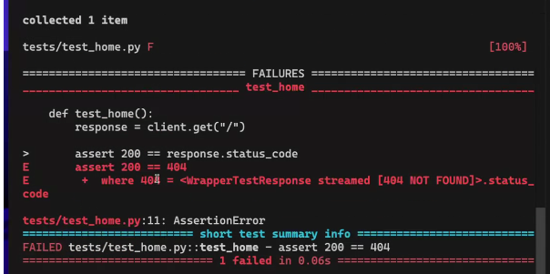
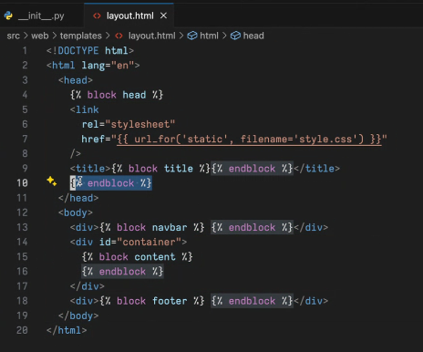
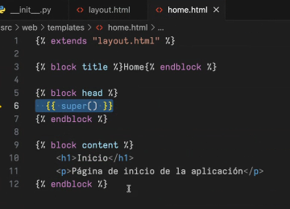
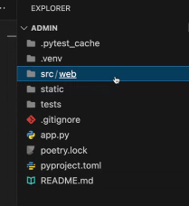
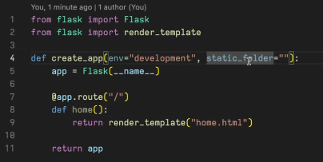
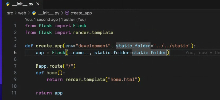
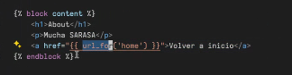
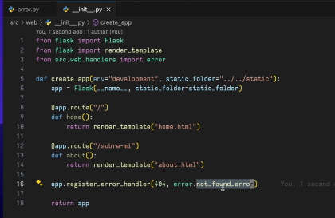

# Explicación actividad 2 
1. Crear con **Poetry** para el manejo de paquetes
2. Instalar Flask y pytest
3. Personalizar un controlador hola mundo. 
4. Template básico layout.html usando Flask.
5. Personalizar el error 404. 
6. Fusionar a main.
---
Al mismo nivel que la computadora es crear el proyecto. 
```shell
poetry new --name web --src admin 
// Crea la estructura de carpetas, con web que estará el proyecto 
// Admin quedará a la par de la calculadora. 
```
- Abrir en admin el editor. 
```python
 // Instalar dependencias con poetry 
 poetry add flask@latest 
 // crea un entorno virtual (.venv) si no tiene uno, puede usarse 
 `poetry init` como está en la teoría
```
El archivo .toml estará toda la información del proyecto, todo lo que el proyecto necesita.

Al hacer `poetry install` se instalaran todas las dependencias necesarias para el proyecto en el archivo `pyproject.toml`, se puede cambiar la versión de lo que está corriendo. 

En poetry.lock están desccriptas todas las dependencias con su versión exacta, tiene todo lo que se va instalar, se genera solo.
En caso de que tengamos que tirar el entorno virtual es necesario reinstalar las dependencias (`poetry install`)
Se instala la dependencia en el apartado de 'dev.dependencies' pytest (ncesario para testear) ya que estas dependencias solo serán necesarias para el desarrollo cosa que para cuando se pase a producción no tiene sentido que los tests corran.
```
poetry add --group dev pytest@latest
```
Con `poetry show <dependencia>` nos sale toda la info de la dependencia 
Con `poetry show --all` accedemos ala info de todo lo instalado en el ambiente virtual. con el flag `-t`  muestra como un árbol.  

Es necesario activar el entorno con `poetry run <dependencia> ` o `poetry shell`
Se desactiva con `exit`. 

Dentro del módulo web creamos un arch (en el __init_ _.py):
```python
#src/web/__init__.py
from flask import Flask

def create_app(env="development", static_folder="") #Son necesarios estos dos parámetros para producción. 
    app = Flask(__name__) #instanciamos a flask

    @app.route("/") #Decorador, en la ruta "/", ejecute esta función (controlador)
    def home():
        return "Hola mundo!", 200 #Podemos forzar en devolver cualquier code status de esta forma. 
    
    return app
```
El entrypoint será app.py (por convención)
```python
#app.py
from src.web import create_app
app = create_app()

if __name == "__main__":
    app.run()
```
Para llevar adelante la aplicación usamos el comando `flask run --debug` que abre un host. En caso de que el nombre sea otro usamos `flask --app <nombre_del_archivo> run --debug` 
¡No olvidar ejecutar con debug activo (símil a nodemon en node)!

---
Dentro de la carpeta tests creamos un archivo `test_home.py` 
``` python
from src.web import create_app
app = create_app()
app.testing = True
client = app.test_client()

def test_home():
    response = client.get("/")

    assert 200 == response.status_code 
    assert "Hola mundo!" in str(response.data)

```
Una vez hecho los tests corremos el test con `pytest` en consola que nos dará el resultado. El comando ejecutará todo los archivos que tengan como inicio de nombre "test_..."


---
## Jinja
En src/web/templates (directorio con los templates) en el que tendremos los archivos .html. Dentro tendremos el layout básico con bloques modificables. 


El layout permite armar un árbol, con un nodo principal básico, el resto herederá de él. 


Las hojas de estilo las agregaremos en la carpeta **static** . Por ejemplo se verá de esta forma "static/style.css". No tenemos que olvidar que en el parámetro de create_app pasar `static_folder="../../static"`


Para renderizar el html 




---
La imagen muestra la funcion url_for para saltar de un link a otro,es propio de flask y Jinja. Es una forma de saber a donde ir. El parámetro de url_for es el nombre del controlador, de la función (no del parámetro del decorador). 


--- 
## Manejo de errores
Podemos personalizar una página estándar para los errores de páginas no encontradas. 
Entonces creamos un archivo html `error.html`, un layout para errores que puede extender del nodo inicial. 

Dentro de src/web/handlers (carpeta que será para lógica auxiliar) y crear el archivo `error.py` (no olvidar el init__.py) 
```python
from flask render_template

#Opcionalmente podemos crear una clase Error
class Error:
    code: int
    message: str
    description: str

def not_found_error(e): #Parámetro opcional
    error = {
        "code": 404,
        "message": "Not found",
        "description": "blabla"
    }
    error = Error(404, "mensaje", "descripción")

    return render_template("error.html", error = error), 404
```
En el archivo donde definimos los controladores agregamos el nuevo handler 

La función register_handler(404, manejador_del_error) es propia de Flask, lo ejecutará cuando no encuentra el controlador a una ruta pedida por el cliente. 
Los errores básicos 404, 500, 201, 301, 400

---
Sin haber creado los templates hacer un push de los controladores para mandar a deploy (no olvidar seguir los pasos). 
Lo mejor es apenas tengamos el primer controlador con el string mandar a producción. 