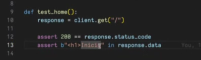
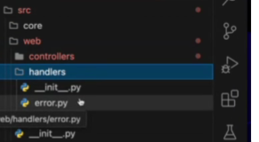
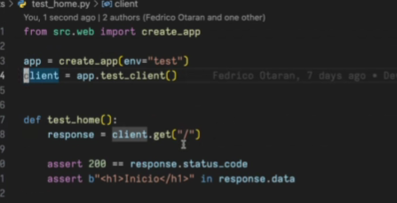
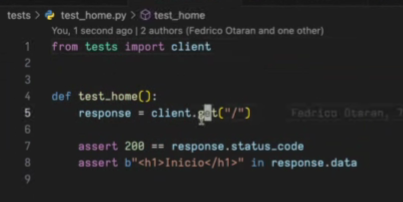

# Explicación clase 3 - Proyecto de Software

## Caso Tests

_Al ejecutar pytest nos sale que el binario no se encuentra en el documento._


_Acá probamos una parte de la vista. Da **true**_


## Creación de blueprints 
Es agregar más controladores a la aplicación sin necesidad de definirlo en un solo archivo. 

_Hasta el momento hacemos esto, pero lo más correcto y prolijo no es hacer esto_ 
Dentro de `src/web/controllers/issues.py` siendo issue el nombre de un recurso, como una consulta o tarea. 

```python
from src.core import board
from flask import render_template

def index():
    issues = board.list_issues() #Simula ser un orm

    return render_template("issues/index.html", issues=issues) 
```

_Html de ejemplo_
en `src/core` (núcleo, donde estarán todos los modelos, las funciones y cómo interactuan con ellos, donde estará la lógica de negocio) que servirá incluso para programar para diferentes entornos y en `src/web` todo lo relacionado con la web (controladores, los handlers)


En `src/core/board.py` será el entrypoint de core. Entonces: 
```python
def list_issues():
    issues = [
        {
            "id": 1,
            "email": "data"
        },{
            "id" : 2,
            "email": "otroemail@gmail.com"
        }
    ]

    return issues
```

En `issues.py` (del controlador) creamos el blueprint entonces: 
``` python
from flask import Blueprint

bp = Blueprint("issues", __name__, url_prefix="/consultas")  #un prefix personalizado

@bp.route("/") #Ante una solicitud /consultas/ se obtendrá esta función
def index():
    issues = board.list_issues()

    return render_template(...)
```
En donde está el create_app tenemos que registrar el blueprint
```python
#src/web/__init__.py
from src.web.controllers.issues import bp as issues_bp
from src.webhandlers import error


def create_app(...):
    # ... Configuración del servidor
    
    app.register_blueprint(issues_bp)
    return app

```

## Excepciones 
```python
def create_app():
    app...
    raise Exception ("Probando excep")
    return app


```

Al abrir desde navegador saltará el error, ahí podremos abrir una consola python la cual podemos poner el código pin debug. Esa consola está con todo el contexto hasta donde se rompió el programa. 
  
_Podemos ver dónde se rompió el sistema, o al menos el estado de las variables_

## Configuraciones 
```python
def create_app(env="development") #produccion, testing
```
El encabezado podemos controlar el ambiente que queremos manejar, podemos configurar inclusive como ejemplo 3 bases de datos diferentes. 
Para tener eso necesitamos crear un objeto config. 
Entonces, en `src/web/config.py`
```python
class Config(object):
    SECRET_KEY = "Secret"
    TESTING = Flase
    SESSION_TYPE = "filesystem"

class ProductionConfig(Config): #Heredan de config
    pass

class DevelopomentConfig(Config):
    pass

class TestingConfig(Config):
    TESTING = True

config = {
    "production": ProductionConfig,
    "development": DevelopmentConfig,
    "test": TestingConfig
}
```

entonces, en el create_app 
```python
from src.web.config import config

def create_app(env="development"):
    app.config.from_object(config[env]) #No olvidar que es un diccionario, entonces está accediendo a la clase 
    print(app.config) #Imprime la configuración de Flask 
```


En el caso del testing podemos mejorarlo con el nuevo objeto creado, entonces queda de esta forma:


Ya que python empaqueta podemos mudar la configuración de app al `__init__.py` de la carpeta `tests` y no tener que repetir la cabecera en todos los tests que se escriban, solo se importaría  


## Adicional
Flask tiene una consola interactiva con `flask shell`. Es similar a la que te habre el navegador cuando salta un error. Podemos probar para ver si una función retorna lo que debe retornar o para ejecutar algún script. 


En Python existe una librería Flask-Shell-Ipython que mejora la interacción. 
Se instala con `poetry add --group dev flask-shell-ipython@latest` 
Una vez hecho eso lo ejecutamos con `flask shell` abre ipython en la que quedan los comandos, tiene una salida más estética, etc.
