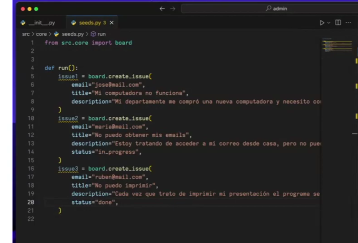
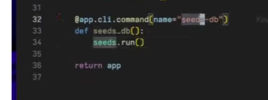
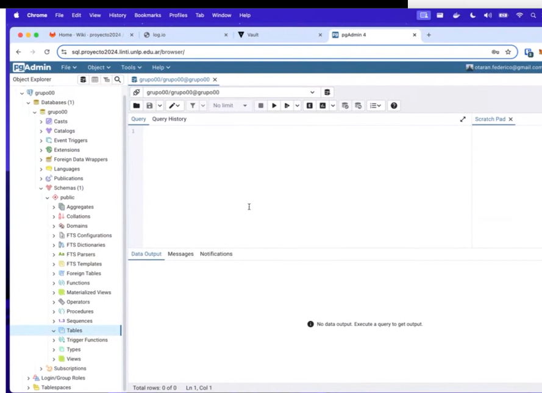
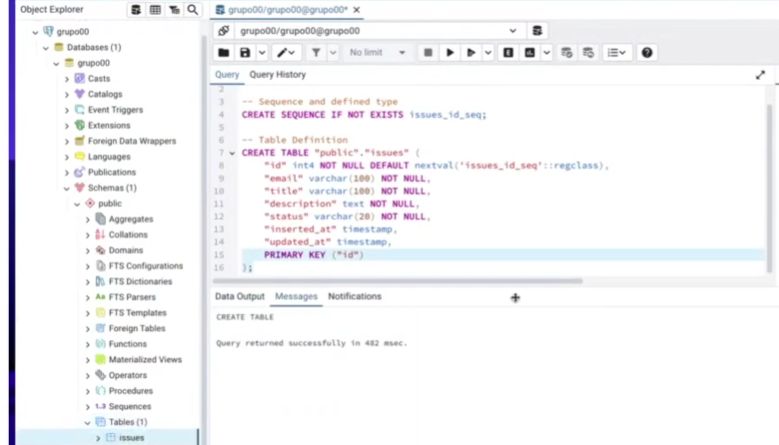

- Evitar usar librerías xd preguntar con la ayudante
- Todo usuario del sistema es miembro del equipo pero no todo miembro del equipo tiene un usuario en el sistema. 

---

## Configuracion
Usa pico como framework en para HTML/CSS

Instalar dependencias necesarias para manejar la BD.

```
poetry add psycopg2-binary@latest
poetry add flask-sqlalchemy@latest
```

En `core` configuramos la base de datos.
```python
#database.py
from flask_sqlalchemy import SQLAlchemy

db = SQLAlchemy()

def init_app(app):
    """
    Inicializa la base de datos con la aplicación de flask
    """

    db.init_app(app)
    config(app)
    return app


def config(app):
    """
    Configuración de hooks para la base de datos. 
    """

    @app.teardown_appcontext
    def close_session(exception=None): #No se generan conexiones extras por cada consulta
        db.session.close()

    return app

def reset():
    """
    Resetea la base de datos.
    """
    print("Eliminando base de datos...")
    db.drop_all()
    print("Creando base nuevamente...")
    db.create_all()
    print("Hecho")


```

Una vez hecho eso hay que volver a configurar la aplicación flask. 

```python
#src/web/__init__.py
from src.core import database

def create_app(env=development, static_folder="../../static"):
    app = Flask(__name__, static_folder=static_folder)

    database.init_app(app)

    # ... resto de config
    return app
```

Para agregar un **comando nuevo** para usar en Flask tenemos que configurarlo en la definición de la app. 
```python
def create_app(...):
    app = Flask(...)
    
    #...

    @app.cli.command(name="reset-db") #De esta forma se registra un comando
    def reset_db():
        database.reset()

    return app

```
Entonces usando en la terminal `flask <nombre_comando>` se ejecuta el comando elegido. Para el caso puntual de recién se utilizaría entonces `flask reset-db`.


## Base de datos: Postgresql
Para definir un modelo será necesario crear un nuevo file. Entonces mapea el modelo con esta información:

```python
#src/core/board/issue.py
from datetime import datetime
from src.core.datebase import db

class Issue(db.Model):
    __tablename__ = "issues"
    id = db.Column(db.Integer, primary_key=True)
    email = dm.Column(db.String(100), nullable=False)
    #... resto de columnas
    updated_at = db.Column(db.Datetime, default=datetime.now, onupdate=datime.now)
    inserted_at = db.Column(db.Datetime, default=datetime.now)

    def __repr__(self): #Cuando me traigo de la bd me traigo esta info
        return f"'<Issue #{self.id} title="{self.title}" status="{self.status}">'"
```

Reacomodando lo hecho previamente, board se ocupa de manejar todo el comportamiento en este caso: 

```python 
#src/core/board/__init__.py
form src.core.board import Issue

def list_issues():
    issues = Issue.query.all()
    return issues

def create_issue(**kwargs):
    issue = Issue(**kwargs)
    db.session.add(issue)
    db.sesssion.commit()
    return issue
    
```

Para poder cargar información a la base de datos podemos crear seeds. Entonces: 




Si abrimos `flask shell` tenemos todos los modelos entonces:
```c
>> from src.core import board
>> board.list_issues()
[
    <Issue #1 title="...">,
    <Issue #2 title="...">,
    ...
]

>> board.create_issue(
    email="jose@mail.com",
    title="Mi computadora no funciona",
    description="..."
)
```

---

### Importante: sobre variables de entorno
Para el caso de producción las variables de entorno que se usarán estarán dadas por Vault. Momento: https://youtu.be/ahanyyXGY48?t=5566 .

Para el caso de variables de entorno de desarrollo podemos usar dotenv(se dio en la teoría). 

---

## La base de datos y producción

En la wiki de cada grupo ponemos `Acceso a la base de datos` (= login de gitlab). Accedemos a tools > Import > grupoXX.json> next > next y aparecerá en servers la base de datos. Dada la wiki, accedemos a la clave y se la coloca en el server para tener acceso. Se nos abre una ventana de pgadmin en la que podemos poner querys 


De la base de datos copiamos el script para crear la tabla y ejecutamos en pgadmin de producción


## Relaciones en SQLAlchemy
Los últimos diez minutos están copadísimos

```python
#src/core/auth/user.py

from src.core.database import db

class User(db.Model):
    id = db.Column(db.Integer, primary_key=True)
    email = db.Column(db.String(255), nullable=False)
    #...
    password = db.Column(db.String(255), nullable=False)
    updated_at = db.Column(...)
    issues = db.relationship("Issue", back_populate="user")


    def __repr__(self):
        return f'<User #{self.id} email="{self.email}">'
```

```python
#src/core/board/issue.py
class Issue(db.Model):
    #...
    user_id = db.Column(db.Integer, db.ForeignKey("users.id"), nullable=False) #Columna en la BD
    user = db.relationship("User", back_populates="issues") #Relacion que creará el método en la clase


    def __repr__(self):
        return f"<...>"
```

```python
#src/core/auth/__init__.py 

'''
Acá se vuelven a usar las funciones para manejar el modelo
'''
from src.core.auth.user import User

def list_users():
    users = User.query.all()
    return users

def create_users(**kwargs):
    user = User(**kwargs)
    db.session.add(issue)
    db.session.commit()
    return user

```

```python
#src/core/board/__init__.py
def assign_user(issue, user):
    issue.user = user
    db.session.add(issue)
    db.session.commit()

    return issue
```

```python
#src/core/board/issue.py
from src.core.database import db

issue_labels = db.Table(
    "issue_labels",
    db.Column("issue_id", db.Integer, db.ForeignKey("issues.id"), primary_key=True),
    db.Column("label_id", db.Integer, db.ForeignKey("labels.id"), primary_key=True)
)

class Issue(db.Model): #Relación mucho a muchos, entonces es necesario crear una tabla intermedia
    __tablename__ = "labels"
    id = db.Column(db.Integer, primary_key=True)
    labels = db.relationship("Label", secondary=issue_labels) #Acá se define la relación, no agrega la relación del otro lado


    def __repr__(self):
        return ""

```
