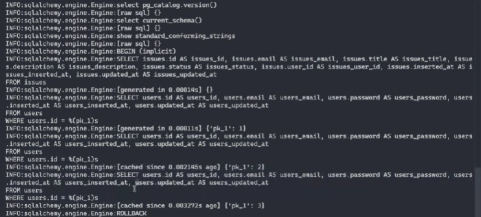
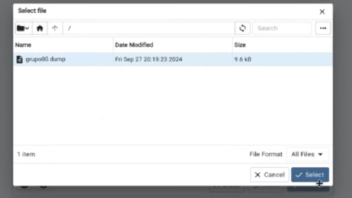

# Explicación práctica - clase 3 - autorización 

## Configuración de los logs de la BD (opcional, solo es para obtener más información). 
Se puede configurar los mensajes (loggers) para el momento del desarrollo. 


```python
#admin/src/web/__init__.py 
import logging 

logging.basicConfig()
logging.getLogger("sqlalchemy.engine").setLevel(logging.INFO)


```


_Ejemplo de consulta a la base de datos con el logger_ 


---

## Cargar en pgadmin la base de datos local
Es necesario averiguar cómo crear `.dumps` para levantar la base de datos en el servidor. 

Pasos: 
- Acceder a pgadmin>servers>databases>grupoXX y click derecho sobre el elemento. Click a `Backup` (para generar un dump), Click a `Restore` (para subir un dump -esto es lo que tenemos que hacer para la base de datos de producción-).
- Aparecerá una nueva ventana. Click a subir un archivo, seleccionar `Upload` en las opciones que se muestran. 
- Seleccionar file. Subirlo. Una vez hecho cerrar la ventanita. Veremos en pantalla esto y presionamos `Select`: 

- En la nueva ventana presionamos la opción `Restore` que confirma la subida del archivo .dump


> Consejos: ya subir cosas a producción xd 

---

## Configuración variables de entorno en producción (Vault) - (min 19:00)  


```python
#src.core.config.py

class ProductionConfig(Config):
    SQLALCHEMY_DATABASE_URI = environ.get("DATABASE_URL") 

```

---

## Chequeo de permisos 
