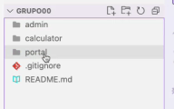
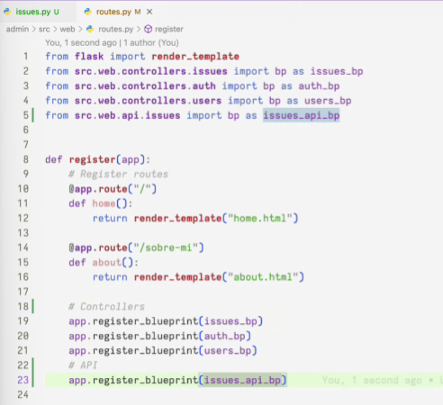
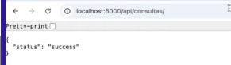
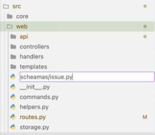
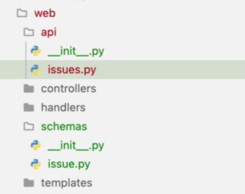
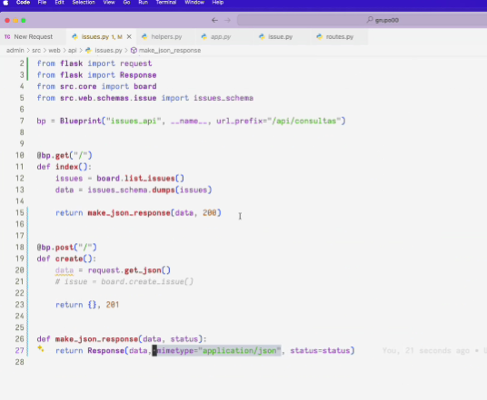
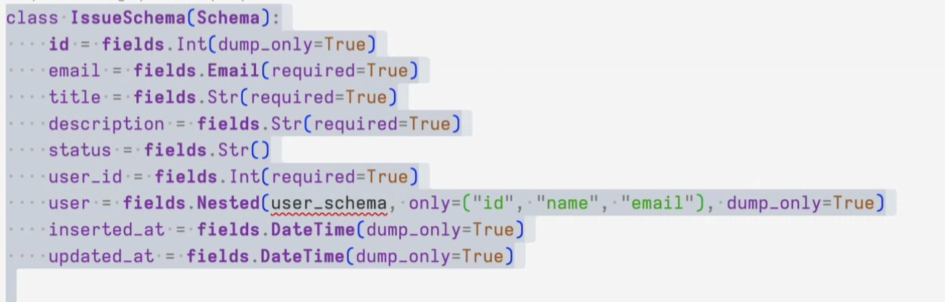
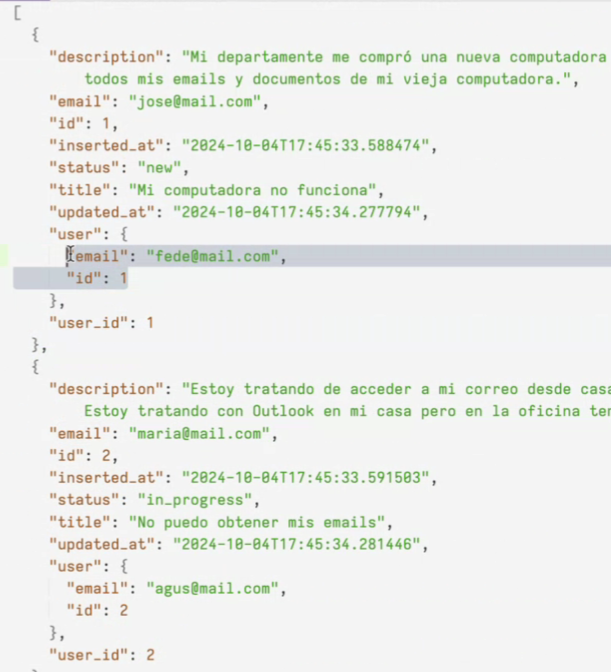

# Explicación práctica - 01/11 

Ahora la respuesta de los controladores no solo responderán HTML, sino JSON. 
La aplicación VueJS consume esa API. 

> Tener en cuenta: la carpeta se debe llamar portal al mismo nivel que admin. 
    

## Sobre el enunciado

Puede existir el rol Editor o se puede asignar esos permisos a algo. Sujeto a modificacion. Seguro cambien el enunciado.

Módulo 2: mostrar en pantalla los reportes con gráficos etc. De los diferentes módulos se toma información. Nosotros elegimos a qué rol mostrar la información. Por ejemplo, si es algo más administrativo mostrar solo a administrativos y no a los docentes. 
Se pueden usar librerías, con JS con Py, (ej. matplotlib, c3) Puede ser una librería para generar la información y otra librería para volcarla. 

Módulo 3: un usuario que no tiene ningún tipo de rol se quiere contactar con la institución que quiere enviar mensajes. No es necesario el permiso CREATE para administración. 
El estado puede ser Leído, no leído. En progreso, finalizado, etc. A nuestro criterio.

Módulo 4 (API): revisar el link de la API mínima. Se pueden agregar más rutas. Como por ejemplo, crear una ruta para obtener todas las categorías para un mensaje. 

Módulo 5: Registro con Google.  

Aplicación Pública.
Módulo 1: Agregar mapa, secciones, mostrar las noticias, etc. Cosas bonis uw
Módulo 2 - Contacto: matchea con la app privada (módulo 2). Utilizar lo del captcha. TODO con VALIDACIONES.
Módulo 3 - Actividades y noticias: matchea con el módulo 1.

Aclaraciones: npm y poetry serían herramientas similares.

---

## Demo (37:10)

Los controladores ahora responderán con JSON. 
Creamos una nueva carpeta al nivel de controladores (`src/web/api`)

```python

#Debe tener un nombre diferente
bp = Blueprint('issues_api', __name__, url_prefix="/api/consultas")

@bp.get('/')
#No son necesarios los permisos
def index():
    
    return {"status": "success"}, 200 #JSON
```

Es necesario registrar la ruta: 



Finalmente, al acceder a la ruta: 



Recomendación del profe: usar herramientas de clientes de API (42:50) como ThunderClient, Postman funciona igual


Es necesario utilizar mapeadores (min 50:00), se sugiere usar _Marshmallow_ que permiten realizar los mapeos como SQLAlchemy. 

```
poetry add marshmallow@latest
```
min 55:19 definicion de marshmallow

Crear mapeadores (schemas)





Se mapean uno a uno los atributos que se quieran exponer:
Hay dos procesos: dump y load (min 58:00)

- dump -> pasar el objeto al resultado en formato JSon o diccionario (data que egresa)
- load -> pasar de diccionario/Json a un objeto (data que ingresa) 

```python
from marshmallow import Schemas, Fields 

class IssueSchema(Schema):
    id: field.int(dump_only=True) #Esto setea el id cuando egresa la información, no cuando ingresa, lo ignora
    title: fields.Str(required=True) #Estas serían como validaciones. Si o sí se requiere este campo. 
    email: fields.Email()
    status: fields.Str()
    user_id: fields.Int(required=True)
    description: Fields.Str()
    ...
    updated_at = fields.DataTime(dump_only=True) #Voy a querer mostrar pero no voy a permitir que ingresen este tipo de atributos. 


#Instanciamos un schema 
issue_schema = IssueSchema() #Esta instanciación nos servirá para pdoer exportar este objeto. Un sólo issue
issues_schema = IssueSchema(many=True) #Mapea una lista de los objetos. No solo una instancia -tupla-, será un listado

#Podemos definir multiples formas de mapear minuto 72:10. También se podría crear otro schema (minutos 72:20)
simple_issue_schema = IssueSchema(only={"id", "title", "status"})
#Se puede mapear para consulta o para crear, lo definimos como querramos
```


```python
from src.web.schemas import issues_schema
from flask import jsonify #Ayuda a setear headers en la respuesta minuto 90:00
#También se podría usar el make_responde o Response minuto 91:10
@bp.get("/")
def index:
    """
    Retorna una lista con los issues en formato JSon
    """
    issues = board.list_issues()
    #Min 65:00
    data = issues_schema.dump(issues) #LO PASAMOS POR EL MAPEADOR 
    #Usan .dumps ya lo hace Json leer documentación: Minuto 71:00
    #min 83:00 al usar .dumps el return nos queda (ordenado alfabeticamente): return data, 200

    return {"data": data}, 200 #Esto se puede configurar en el schema, para que la lista esté dentro de un data. Revisar en la bibliografía

    return jsonify(data), 200 # -> esta sería la respuesta correcta

    return Response(data, mimetype:"application/json", status=200) # -> esto usando make response o response. Investigar

```

> **Los mapeos deben realizarse dentro del SCHEMA**

> Revisar la documentación, hay un campo interesante, el **EXCLUDE** je


---

> Revisar los headers de las respuestas de la API, como opciones tenemos response, make_response, jsonify. 
     
    _Acá el profe definió una función extra como helper al cual llama para retornar una respuesta predeterminada pasandole la data. Así los headers ya quedan definidos para todos los controladores. Spoiler: lo descarta mas adelante_

### Recibir data (min 87:50)
```python

from flask import request
from src.web.schema.issue import create_issue_schema


@bp.post("/")
def create():
    attrs = request.get_json() #Obtener data por parámetro, lo parsea a un diccionario 
    # Esta data es necesario pasarlo a las validaciones del schema
    errors = create_issue_schema.validate(attrs) #Si hay errores me pasa una lista con los errores, no se rompe Minuto 104:00
    print(errors)

    if errors: #Minuto 105
        return make_json_response(jsonify(errors), 400)
    else:
        #Acá ya sabemos que no hay errores 
        kwargs = create_issue_schema.load(attrs) #Crea la data, en este momento está listo para ser creado
        new_issue = board.create_issue(**kwargs) #Crea el objeto y lo retorna. En este caso, puede fallar acá, se podría usar un try/catch, o un if y envair el error. Minuto 115-116
        data = issue_schema.dump(new_issue) #Lo pasa por marshmallow, hago el dump para mostrar como respuesta. 
        return jsonify(data), 200 #Alrededor del minuto 113:00 explica esto

#Puede usarse try/catch

#--- En el archivo donde declaramos el schema de Issue
create_issue_schema = IssueSchema(only={"email", "title", "descript", "user_id"}) #Esto en el schema está definido como required = True

```

minuto 98:15 define una solicitud con json: 
```json 
{
    "title": "titulo del issue",
    "description": "una descrip",
    "email": "..."
}
```
En el minuto 109 el prof descartó la función que había hecho al inicio y volvió a usar Jsonify (siempre fue la mejor opcion xd)

Minuto 117:00. Los schemas se pueden embeber, se puede armar un "arbolito". Entonces, en el ejemplo un issue está asociado a un usuario por lo que podemos hacer un mapeo de la sigueinte forma 

De esta forma tendríamos que crear un nuevo schema para el **user** el cual usaremos en el Issue, en el issue especificamos los campos que queremos ver. 
Con la instruccion `user = fields.Nested(user_schema,...)` armamos lo anidado. 


