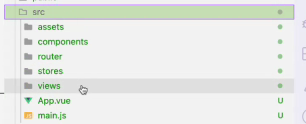

# Explicación práctica 08/11 

## Creación de la app VueJS 

Carpeta _portal_ a la misma altura que _admin_ porque es una aplicación totalmente diferente. Podría estar en un repositorio diferente. 

En la terminal dentro de _portal_ 
```console 
#Elegir esta versión porque es la que se tiene en el servidor
asdf local nodejs 22.7.0 
npm create vue@latest
```
Es interactivo, asi que creamos 
Si colocamos `.` se usa la carpeta en la que está parado sino crea otro. 
Nombre del paquete: portal-web
TypeScript > NO 
JSX support > NO 
Vue Router SPA development > YES #librería auxiliar
Pinia para manejos de estado > YES 
Vitest for Unit Testing > NO 
END TO END > NO 
ESLint for Code quality > YES
Prettier for code formatting > YES
... Se crea la app Vue Js basic  
Se nos ofrecen los comandos 


En la carpeta _public_ tendremos los assets: _src_ donde estará el proyecto; el resto son archivos de configuración. 

`index.html` es el HTML principal de la aplicación. Es donde se encuentra `main.js`. único contenedor de todo.  
En el `package.json` tenemos la parte de scripts. Ahí tenemos los comandos que se ejecutan con `npm run <comando>`: 


El comando `npm run build` es el más importante, porque es el que compila la aplicación y dejarla lista para producción. Se tiene que ejecutar todo con `npm run build`. Los archivos que se generan con el comando se suben a producción. Dejan el pipelina listo. 

El comando `npm run preview` permite ejecutar la aplicación que se generó con el build, es como hacerlo como en **modo produccion**

El comando lint y format ejecutan eslint y format correspondientemente. 

En el `src` se tienen diferentes archivos.  


`main.js` es el archivo que crea la aplicación. Instancia, configura y ejecuta. Con `app.mount(#app)` se carga en el `<div>` del html `index.html` que es donde se cargará el contenido dinámico. 

Se carga el html `index.html` llama al contenido `main.js` que monta la aplicación en el tag con el id correspondiente. 
`App.vue` posee un template con scripts, template, navbar y style. 

### Sobre estrutura de carpeta 
`assets`: Imágenes, css, relacionado con archivos estáticos. 
`components`: todos los componentes de Vue.
`router`: indica como maneja las rutas de la aplicación. Indica la ruta y qué contenido debe mostrar. Hay dos formas diferentes de cargar una ruta. 1. Importar el contenido arriba y lo asocia a la ruta o 2. un Import lazy loaded, cuando se visita la página recién lo carga. 

`stores`: directorio donde se crean los diferentes stores de Pinia. Es para el manejo de estados. Lo que se busca es separar o agregar una capa entre el componente y el estado del componente y la información del mismo. Manipula la data que el componente termina mostrando. 

`views` dentro están los componentes. Están los templates básicos que renderizan lo básico. No tiene lógica. 


---
### Iniciar aplicacion (min 47)

```
asdf local nodejs 22.7.0 #Global, no hay un entorno como en py
npm install #Se genera el node_modules
npm run format #Ejecuta prettier
npm run dev #Corre la aplicación en localhost
```
Todo lo que sucede al clickear sobre elementos que poseen rutas no hace ningún request al backend; simula serlo (min 50)

Explicación del pipeline > min 56:10

El `mc mirror ` es para minio, los archivos estáticos se mueven a minio al bucket correspondiente e indica la url del sitio. 

### Ejemplo (min 60:30)
- Crear componente de una tablita de issues. 

¿Cómo obtener la información? 
En `stores` conseguimos la información. Creamos un `issues.js`

```javascript
import {defineStore} from 'pinia'

export const useIssuesStore = defineStore('issues', {
    //Definimos un json 
    state: () => ({ //Se pueden almacenar variables auxiliares para la lógica de la app
        issues: [] //Lista de issues. Variable que aparecerá en el componente
        loading: false, //Variable que indica si está cargando o no 
        error: null
    }),
    actions: { 
        async fetchIssues(){ //Acción que hará obtener la información q se quiere guardar en el estado.
            try{
                //Inicializamos algunas variables auxiliares
                this.loading = true 
                this.error = null
                //Acá se haría el llamado a la API El prof lo harcodea (min 65)
                this.issues = [...]
            } catch(error){
                thos.error = 'An error occured' //Si pasa algo malo en la consulta a la API 
                console.error(error)
            } finally{ //Se ejecuta siempre
                this.loading = false //Que finalizó la consulta a la api 
            }
        }
    }
})
```

Dentro de `components` creamos un file `IssuesList.vue`:


`v-if` directivas de VueJS, si la variable es true muestra el texto (línea 4). 

> Repasar directivas mostradas en la teoría. 

Aca Pinia hace la sincronización con lo definido previamente. 


Se ejecuta la función definida en el store. Es un pasamos de información. 


Ahora es necesario crear una ruta para mostrar el componente. (min 74:50)
En views creamos la vista e importamos el componente: 

Generamos el enlace

en `index.js`, en el router le cargamos la vista asociada a la ruta 

En el minuto 77:40 explica el camino inverso, qué es lo que genera una acción en la vista. 

min 82:10
Usaremos **Axios**. Librería que actuará como cliente. 
Se instala `npm install axios` y realizamos un `import {axios} from 'axios'` (se puede usar el fetch nativo).


Hay que exitar hardcodear la declaración del base_url -> se podrían usar variables de entorno.

(min 90:40) Explicación CORS: restringe las consultas entre servidores que tienen dominios diferentes. Como front corre en 5173 y el back en 5000, como es un método de seguridad no lo permite. Solucion: configurar el back.
```python
#En la app py
poetry add flask-cors@latest
```
Investigar CORS para producción y development

```python
from flask_cors import CORS

def create_app(...):
    app = Flask(...)
    ...
    CORS(app)

    return app

```

#### Documentación CORS 


min (105.40) explicación para subir a prod la aplicación de Vue. 