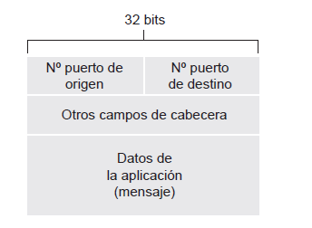

# Redes y comunicaciones - Capa de transporte

## Introducción 
Proporciona directamente servicios de comunicación (lógica) a los procesos de aplicación que se ejecutan en hosts diferentes. Desde la perspectica de la aplicación, es como si los hosts que ejecutan los pocesos estuvieran conectados directamente.
Los protocolos de esta capa están implementados en los sistemas terminales, pero no en los routers de la red. 
En el lado emisor, la capa de transporte convierte los mensajes que recibe procedentes de un proceso de aplicación emisor en paquetes de la capa de transporte -> **segmentos**. A continuación, la capa de transporte pasa el segmento a la capa de red del sistema terminal emisor, donde el segmento se encapsula dentro de un paquete de la capa de red (un datagrama) y se envia al destino. En el lado receptor, la capa de red extrae el segmento de la capa de transporte del datagrama y lo sube a la capa de transporte. Esta capa procesa el segmento recibido, poniendo los datos del segmento a disposición de la aplicación de recepción.

## Capa de transporte en Internet
- UDP (_User Datagram Protocol_): proporciona un servicion sin coneción no fiable a la aplicación le invoca. La _entrega de datos procesos a proceso_ y _comprobación de errores_ son los dos únicos servicios que ofrece este protocolo.
- TCP (_Transmission Control Protocol_): proporciona a la aplicación que la comunicación sea fiable. Ofrece más servicios adicionales, las más importantes: 
    -  **transferencia de datos fiable**: utiliza técnicas de control de flujo, números de secuencia, temporizadores. 
    - **Control de congestión**: evitan que cualquier conexión TCP inunde con una cantidad de tráfico excesiva los enlaces y routers existentes entre los hosts que están comunicándose. 

La responsabilidad principal de UDP y TCP es ampliar el servicio de entrega de IP entre dos sistemas terminales a un servicio de entrega entre dos procesos que estén ejecutándose en los sistemas terminales. Extender la entrega host a host a una entrega proceso a proceso es lo que se denomina **multiplexación** y **demultiplexación** que proporcionan servicios de comprobación de la integridad de los datos al incluir campos de detección de errores en las cabeceras de sus segmentos. 

### Multiplexación y demultiplexación
Un proceso (como parte de una aplicación de red) puede tener uno o más sockets, puertas por las que pasan los datos de la red al proceso y viceversa. La capa de transporte del host receptor realmente no entrega los datos directamente a un proceso, sino a un socket intermedio.  Dado que en cualquier instante puede haber más de un socket en el host receptor, cada socket intermedio. Dado que en cualquier instante puede haber más de un socket en el host receptor, cada socket tiene asociado un identificador único. 
- Demultiplexación: es la tarea de entregar los datos contenidos en un segmento de la capa de tansporte al socket correcto. 
- Multiplexación: es la tarea de reunir los fragmentos de datos en el host de origen desde los diferentes sockets, encapsulando cada fragmento de datos con la información de cabecera para crear los segmentos y pasarlos a la capa de red. 
Conocemos que la operación de multiplexación que se lleva a cabo en la capa de transporte requiere que los sockets tengan identificadores únicos y que cada segmento tenga campos especiales (**número de puerto de origen** y el **campo número de puerto de destino**) que indiquen el socket al que tiene que entregarse el segmento. Cada número de puerto es un número de 16 bits (de 0 a 65535). 
Los números de puerto pertenecientes al rango de 0 a 1023 se conocen como **números de puertos bien conocidos** y son restringidos (reservados para ser empleados por los protocolos de aplicación como HTTP, FTP)

