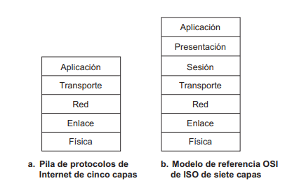

# Práctica 1 - Introducción
## 1. ¿Qué es una red? ¿Cuál es el principal objetivo para construir una red?
Una red se refiere a un conjunto de computadoras/dispositivos interconectados con el objetivo de compartir recursos tales como dispositivos, información y servicios. El conjunto de computadoras, software de red, medios y dispositivos de interconexión forma un **sistema de comunicación**

## 2. ¿Qué es Internet? Describa los principales componentes que permiten su funcionamiento.
Hay dos formas de verlo: 
- Desde el componente hardware y software 
- Desde la infraestructura de red 
### Descripción de los componentes esenciales 
Los **sistemas terminales** (hosts, ya que albergan programas de aplicación) se conectan entre sí mediante una red de **enlaces de comunicaciones** (cable coaxial, fibra óptica, etc.) y dispositivos de **conmutación de paquetes**. Los distintos enlaces pueden transmitir los datos a distintas velocidades y la **velocidad de transmisión** de un enlace se mide en bits/segundo. Cuando un sistema terminal tiene que enviar datos a otro sistema terminal, el emisor segmenta los datos y añade bits de cabecera a cada segmento. Los paquetes de información resultantes, conocidos como **paquetes** en la jerga informática, se envían entonces a través de la red hasta el sistema terminal receptor, donde vuelven a ser ensamblados para obtener los datos originales.
Un conmutador de paquetes toma el paquete que llega de uno de sus enlaces de comunicaciones de entrada y lo reenvía a uno de sus enlaces de comunicaciones de salida. Los tipos más utilizados en Internet son los **routers** (suele utilizarse en el núcleo de la red) y los **switches de la capa de enlace** (se emplean en las redes de acceso) que reenvían los paquetes hacia sus destinos finales. 
La secuencia de enlaces de comunicaciones y conmutadores de paquetes que atraviesa un paquete desde el sistema terminal emisor hasta el sistema terminal receptor se conoce como **ruta** a través de la red.
Los sistemas terminales acceden a Internet a través de los **ISP (Internet Service Provider, Proveedor de servicios de Internet)**, incluyendo los ISP residenciales como son las compañías telefónicas o de cable locales; los ISP corporativos; los ISP universitarios y los ISP que proporcionan acceso inalámbrico (WiFi). Cada ISP es una red de conmutadores de paquetes y enlaces de comunicaciones. 
Internet es todo lo que conecta a los sistemas terminales entre sí, por lo que los ISP que proporcionan el acceso a los sistemas terminales también tienen que estar interconectados entre ellos. Estos ISP de nivel inferior se interconectan a través de los ISP de nivel superior (routers de alta velocidad interconectados a través de enlaces de fibra óptica de alta velocidad). 
### Descripción de los servicios
Internet como _una infraestructura que proporciona servicios a las aplicaciones_ (correo electrónico, navegación web, etc.) siendo las aplicaciones **aplicaciones distribuidas** ya que implican varios sistemas terminales (las apps se ejecutan ahí) que intercambian datos entre sí. 
Los sistemas terminales conectados a Internet proporcionan una **API (Application Programming Interface, Interfaz de programación de aplicaciones)**, que especifica cómo un programa de software que se ejecuta en un sistema terminal pide a la infraestructura de Internet que suministre datos a un programa de software de destino específico que se ejecuta en otro sistema terminal. Consta de un conjunto de reglas que el programa que transmite los datos debe cumplir para que internet pueda entregar al programa destino. 
## 3. ¿Qué son las RFCs?
Las **RFCs (Request For Comments)** son los documentos asociados a los **estándares de internet**. Definen protocolos como TCP, IP, HTTP, SMTP. 
## 4. ¿Qué es un protocolo?
_Un protocolo define el formato y el orden de los mensajes intercambiados entre dos o más entidades que se comunican, así como las acciones tomadas en la transmisión y/o la recepción de un mensaje u otro suceso._
Los sistemas terminales, los conmutadores de paquetes y otros dispositivos de Internet ejecutan **protocolos** que controlan el envío y la recepción de la información dentro de Internet. El protocolo **TCP (Transmission Control Protocol, Protocolo de control de transmisión)** y el protocolo **IP (Internet Protocol, Protocolo de Internet)**, en el que se especifica el formato de los paquetes que se envían y reciben entre los routers y los sistemas terminales, son los dos más importantes.
## 5. ¿Por qué dos máquinas con distintos sistemas operativos pueden formar parte de una misma red?
Al mantener un mismo protocolo, la comunicación entre los sistemas terminales es intercambiando mensjaes a través de la red de computadoras. 
Los procesos se comunican entre sí utilizando la capa de aplicación de la pila de protocolos de cinco capas. 
## 6. ¿Cuáles son las 2 categorías en las que pueden clasificarse a los sistemas finales o End Systems? Dé un ejemplo del rol de cada uno en alguna aplicación distribuida que corra sobre Internet.
Los hosts se clasifican en:
- clientes,
- servidores.
Un **programa cliente** es un programa que se ejecuta en un sistema terminal que solicita y recibe un servicio de un **programa servidor** que se ejecuta en otro sistema terminal que interactúan enviándose mensajes a través de Internet. Estas aplicaciones son **aplicaciones distribuidas**.

_En el contexto de una sesión de comunicación entre una pareja de procesos, el proceso que inicia la comunicación (es decir, que inicialmente se pone en contacto con el otro proceso al principio de la sesión) se etiqueta como el cliente. El proceso que espera a ser contactado para comenzar la sesión es el servidor._

## 7. ¿Cuál es la diferencia entre una red conmutada de paquetes de una red conmutada de circuitos?
Existen dos métodos fundamentales que permiten transportar los datos a través de una red de enlaces y conmutadores: la **conmutación de circuitos** y la **conmutación de paquetes**. En las redes de conmutación de circuitos, los recursos necesarios a lo largo de una ruta que permiten establecer la comunicación entre los sistemas terminales están reservados durante el tiempo que dura la sesión entre dichos sistemas terminales. En las redes de conmutación de paquetes, estos recursos no están reservados; los mensajes de una sesión utilizan los recursos bajo petición y, en consecuencia, pueden tener que esperar para poder acceder a un enlace de comunicaciones. 
Un ejemplo de conmutación de circuitos son las redes telefónicas: antes de que el emisor pueda transmitir la información, la red dee establecer una conexión entre el emisor y el receptor.  Una vez establecido el circuito, también reserva una velocidad de trnasmisión constante en los enlaces de la red para el tiempo que dure la conexión de forma que la transferencia queda garantizada. 
Con la técnica de conmutación de paquetes, cuando un host desea enviar un paquete a otro host a través de Internet, el paquete se envía a la red sin haber reservado ancho de banda. Si uno de los enlaces está congestionado porque existen otros paquetes en la cola, entonces nuestro paquete tendrá que esperar en un buffer en el lado del emisor del enlace de transmisión y por ende, sufrirá un retardo. 

## 8. Analice qué tipo de red es una red de telefonía y qué tipo de red es Internet.
Muchas redes de acceso emplean partes de la infraestructura de la telefonía cableada tradicional local (telco local). Cada residencia dispone de un enlace directo de cobre trenzado a un switch de la compañía telefónica, el cual se encuentra en un edificio denominado **central telefónica**. Una telco posee cientos de centrales y enlaza a cada uno de sus clientes con la central más próxima. Se utiliza el término “acceso telefónico” (dial-up) porque el software del usuario realmente llama al número de teléfono de un ISP y establece una conexión telefónica tradicional con el mismo. el PC está conec-
tado a un módem de acceso telefónico, que a su vez está conectado a la línea telefónica ana-
lógica del domicilio. Esta línea telefónica analógica está hecha de un hilo de cobre de paz trenzado y es la misma línea de teléfono que se emplea para las llamadas telefónicas ordinarias. El módem convierte la salida digital del PC en una señal analógica apropiada para ser transmitida a través de la línea telefónica analógica. En el otro extremo de la conexión, un módem del ISP convierte la señal analógica que recibe en una señal digital que será la señal de entrada para el router del ISP.

## 9. Describa brevemente las distintas alternativas que conoce para acceder a Internet en su hogar. 
Los dos tipos de acceso residencial de banda ancha son:
- **DSL (Digital Subscriber Line)**: el servicio de Internet es con la compañía telefónica que actúa como ISP, entonces cada módem DSL de un cliente utiliza la línea telefónica existente para intercambias datos igual que las señales teléfonicas pero que se codifican con frecuencias distintas. En el lado del cliente, las señales que llegan al domicilio son separadas como señales de datos y telefónicas mediante un circuito separador (splitter) que reenvía la señal de datos al módem DSL. En el lado de la compañía telefónica, en la central, el multiplexor DSLAM separa las señales de datos y de telefonía y envía los datos a Internet. Como ventajas: 
    - transmite y recibe datos a velocidades altas
    - Se puede mantener la conexión a internet mientras se usa el teléfono.

- **Cable**: el **terminal de cabecera de cable** difunde los canales de televisión a través de una red de distribución de cable coaxial y amplificadores hasta el domicilio, entonces, el acceso por cable a Internet utuliza la infraestructura existente. La fibra óptica conecta el terminal de cabecera del cable a una serie de nodos de área situadas en el vecindario del donde se utiliza el cable coaxial para llegar a todos los domicilios. Se utiliza **modems por cable** que se conecta a través de un puerto ethernet. Lo que caracteriza a la conexión por cable es que se trata de un medio de difusión compartido, donde los paquetes se distribuyen a todas las viviendas conectas. Si varios usuarios descargan archivos simultaneamente, la velocidad individual de descarga será menor; dado que el canal de carga también es compartido, se necesita un protocolo de acceso múltiplica para evitar colisiones en las transmisiones. 
- **Tecnología FTTH**: Se utiliza fibra óptica en el cual su distribucion óptica más simple de la ***fibra directa** (fibra que sale de la centra hasta cada domicilio). Proporciona velocidades de transmisión más altas. 
- **Ethernet**: es un red de área local (LAN) para conectar un sistema terminal al router de frontera. Se utilza cable de cobre de par trenzado para a conectarse a un switch Ethernet. 
- **WiFi**: El acceso a Internet es inalámbrico. 
    - **LAN Inalambrica**: los usuarios transmiten paquetes a un punto de acceso el cual a su vez está conectado a la red internet cableada. 
    - **Redes inalámbricas de área extensa**: los paquetes se transmiten a una **estación base** através de la misma infraestructura utilizada por la telefonía móvil. 
Actualmente, las viviendas combinan acceso residencial de banda ancha con tecnología LAN inlámbrica para crear redes dommésticas potentes. 
## 10. ¿Qué ventajas tiene una implementación basada en capas o niveles?
La arquitectura en capas proporciona modularidad, haciendo mucho más fácil modificar la implementación del servicio suministrado por la capa. Dado que la capa proporciona el mismo servicio a la capa que tiene por encima de ella y emplea los mismos servicios de la capa que tiene por debajo, el resto del sistema permanece invariable cuando se modifica la implementación de una capa. 
Una capa de protocolo puede implementarse por software, por hardware o mediante una combinación de ambos. Los protocolos de la capa de aplicación, como HTTP y SMTP, casi siempre se implementan por software en los sistemas terminales, al igual que los protocolos de la capa de transporte. Puesto que la capa física y las capas de enlace de datos son responsables de manejar la comunicación a través de un enlace específico, normalmente se implementan en las tarjetas de interfaz de red

## 13. Describa cuáles son las funciones de cada una de las capas del stack TCP/IP o protocolo de Internet.
### Capa de aplicacion
Es donde residen las aplicaciones de red y sus protocolos (HTTP, SMTP, FTP). Además el **DNS (Sistema de Nombres de Dominio)** realiza la traducción de nombres legibles en direcciones de red de 32 bits. Los protocolos de esta capa están distribuidos a lo largo de varios sistemas terminales, donde se intercambian paquetes de información denominados **"mensajes"**.
### Capa de transporte
Transporta los mensajes de la capa de aplicación entre los puntos terminales de la aplicación. Los dos protocolos principales de esta capa son TCP (ofrece un servicio orientado a la conexión donde se garantiza la entrega de mensajes y control de congestión, divide los mensajes largos en segmentos cortos) y UCP (proporciona un servicio sin conexión, no garantiza fiabilidad, ni control de flujo ni congestión). Los paquetes de información, en esta capa, se denominan **"segmentos"** 
### Capa de red
Es responsable de mover los paquetes **("datagramas")** de un host a otro. Incluye el protocolo IP, que define los campos del dataframa y la forma en que los sistemas terminales y routers actuan sobre ellos. Incluye los protocolos de enrutamiento. 
### Capa de enlace
Mueve un datagrama de un host al siguiente nodo en la ruta. Los servicios de esta capa dependerán del protocolo específico de la capa de enlace utilizando en el enlace. Como ejemplos están los protocolos Ethernet o WiFi. Los paquetes en esta capa se denominan **"tramas"**.
## 11. ¿Cómo se llama la PDU (unidad mínima que atraviesa las diferentes capas) de cada una de las siguientes capas: Aplicación, Transporte, Red y Enlace?
Es el mismo mensaje, pero cada capa le agrega su encabezado/detalle
- Capa de aplicación: mensajes,
- Capa de transporte: segmentos,
- Capa de red: datagramas,
- Capa de enlace: tramas.
## 12. ¿Qué es la encapsulación? Si una capa realiza la encapsulación de datos, ¿qué capa del nodo receptor realizará el proceso inverso?
Encapsulación es el proceso en el cual cada capa del modelo de red añade su propia información de cabecera a los datos recibidos de la capa superior, formando así un nuevo paquete. Este paquete encapsulado se envía luego a la siguiente capa inferior. Por ejemplo, la capa de transporte recibe un mensaje de la capa de aplicación, le añade su cabecera, formando un segmento, y luego lo pasa a la capa de red, que añade su propia cabecera, creando un datagrama.
Cuando un nodo receptor recibe los datos, la capa correspondiente a la que realizó la encapsulación en el emisor realiza el proceso inverso (desencapsulación). Es decir, la capa de red del nodo receptor quitará la cabecera de la capa de red, luego la capa de transporte quitará la cabecera de la capa de transporte, y finalmente, la capa de aplicación recibirá el mensaje original.

## 14. Compare el modelo OSI con la implementación TCP/IP
El modelo OSI es un marco teórico de siete capas para organizar redes de computadoras. Este modelo define una estructura detallada, incluyendo capas adicionales como la de la presentación y la desesión, que proporcionan servicios como la interpretación de datos, comprensión, cigrado y sincronización de la comunicación.
Por otro lado, la implementación TCP/IP es más práctica. La funcionalidad de las capas de presentación y sesión del OSI no está separada; en lugar de eso, cualquier servicio que estas capas proporcionarían, como cifrado o comprensión, debe ser manejado por la propia aplicación si es necesario. Delega a las aplicaciones la responsabilidad de manejar funcionalidades adicionales como las que proveen las capas de presentación y sesión en el modelo OSI. 
El modelo tcp/ip agrupa lsa funcionalidades de las capas extras en uno o lo sipmplifica más que antes estaban en el modelo OSI. 