# Practica 2 
*** 
## Introducción
### 1. ¿Cuál es la función de la capa de aplicación? 
La función de la capa de aplicación es proporcionar servicios de red directamente a las aplicaciones de los usuarios finales, permitiendo la comunicación entre programas que se ejecutan en diferentes sistemas terminales. Esta capa facilita el desarrollo de aplicaciones de red sin necesidad de interactuar con los dispositivos del núcleo de la red, como routers o switches, ya que estos operan en capas inferiores. La capa de aplicación maneja protocolos que son familiares para los usuarios, como HTTP para la Web o SMTP para el correo electrónico, y se encarga de establecer cómo los programas se comunican a través de la red, asegurando que puedan intercambiar datos de manera efectiva.

### 2. Si dos procesos deben comunicarse: 
#### a. ¿Cómo podrían hacerlo si están en diferentes máquinas? 
Si dos procesos están en diferentes máquinas, pueden comunicarse intercambiando mensajes a través de la red de computadoras (independiente de los sistemas operativos). El proceso emisor en una máquina crea y envía mensajes a la red, y el proceso receptor en la otra máquina recibe estos mensajes y puede responder con sus propios mensajes. Esta comunicación se realiza utilizando la capa de aplicación de la pila de protocolos de red.
#### b. Y si están en la misma máquina, ¿qué alternativas existen? 
Si los procesos están en la misma máquina, pueden comunicarse entre sí mediante mecanismos de comunicación entre procesos (IPC), gobernados por las reglas del sistema operativo de la máquina. Estos mecanismos incluyen métodos como colas de mensajes, tuberías, memoria compartida, y semáforos, entre otros.

### 3. Explique brevemente cómo es el modelo Cliente/Servidor. Dé un ejemplo de un sistema Cliente/Servidor en la “vida cotidiana” y un ejemplo de un sistema informático que siga el modelo Cliente/Servidor. ¿Conoce algún otro modelo de comunicación? 
El modelo Cliente/Servidor es una arquitectura de red en la que dos procesos se comunican entre sí: uno actúa como cliente, iniciando la comunicación, y el otro como servidor, que espera para responder al cliente. Este modelo se basa en la interacción entre un cliente, que solicita un servicio o recurso, y un servidor, que proporciona dicho servicio o recurso.
Otro modelo de comunicación es el modelo Peer-to-Peer (P2P), en el cual no hay una distinción clara entre cliente y servidor. En este modelo, cada nodo de la red puede actuar tanto como cliente como servidor, permitiendo que los pares se comuniquen directamente y compartan recursos sin la necesidad de un servidor central. Un ejemplo común es la compartición de archivos P2P, donde cada usuario puede descargar y cargar archivos simultáneamente.

### 4. Describa la funcionalidad de la entidad genérica “Agente de usuario” o “User agent”. 
Un **User agent** es la aplicación o software que actúa en nombre del usuario en un sistema o red. Es un componente que representa al usuario en sus interacciones con servicios en línea, sitios web y otros sistemas. 
En el contexto web, se refiere al navegador que un usuario emplea para acceder a sitios web. Comunica al servidor detalles del navegador, su versión de forma que permite que los sitios adapten su contenido a las capacidades del navegador. 

### 5. ¿Qué son y en qué se diferencian HTML y HTTP? 
HTML (HyperText Markup Language) y HTTP (HyperText Transfer Protocol) tienen funciones y propósitos diferentes:

HTML (HyperText Markup Language): define la estructura y el formato de los documentos web mediante el uso de etiquetas, que indican cómo se deben presentar los textos, imágenes, enlaces, y otros elementos en un navegador web.

HTTP (HyperText Transfer Protocol): Es un protocolo de la capa de aplicación que define cómo los mensajes deben intercambiarse entre un cliente (como un navegador web) y un servidor web. HTTP especifica el formato de los mensajes de solicitud y respuesta y las reglas que rigen cómo y cuándo estos mensajes deben ser enviados entre los sistemas.

### 6. HTTP tiene definido un formato de mensaje para los requerimientos y las respuestas. (Ayuda: apartado “Formato de mensaje HTTP”, Kurose). 
#### a. ¿Qué información de la capa de aplicación nos indica si un mensaje es de requerimiento o de respuesta para HTTP? ¿Cómo está compuesta dicha información?¿Para qué sirven las cabeceras? 
En HTTP, la información que nos indica si un mensaje es de requerimiento o de respuesta se encuentra en la primera línea del mensaje.

##### Mensajes de requerimiento (solicitud):
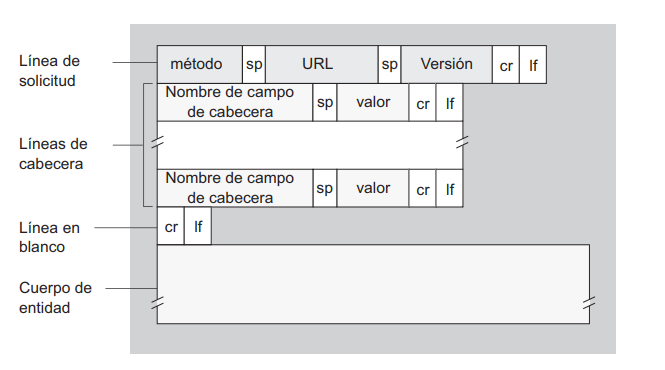

La primera línea se llama **línea de solicitud**. Está compuesta por tres campos:
    **Campo de método**: Indica la acción a realizar, como GET, POST, HEAD, PUT, DELETE, entre otros.
    **Campo URL**: Especifica la dirección del recurso solicitado.
    **Campo de versión HTTP**: Indica la versión de HTTP que se está utilizando, como HTTP/1.1.
Ejemplo de una línea de solicitud:
```bash
GET /unadireccion/pagina.html HTTP/1.1
```
Las siguientes líneas son las **líneas de cabecera**. Proporcionan información adicional sobre el mensaje, facilitan la comunicación de metadatos entre el cliente y el servidor, ayudando a gestionar cómo se debe interpretar y manejar la solicitud o la respuesta. 
    Host: especifica el host del recurso solicitado.
    Connection: indica si la conexión debe mantenerse abierta o cerrarse después de completar la solicitud/respuesta.
    User-agent: identifica el cliente (como el navegador) que realiza la solicitud.
    Accept-language: especifica las preferencias de idioma del cliente.
Después de las líneas de cabecera se incluye un "cuerpo de entidad". Este campo queda vacío cuando se utiliza el método GET, pero no cuando se usa el método POST. 

##### Mensajes de respuesta
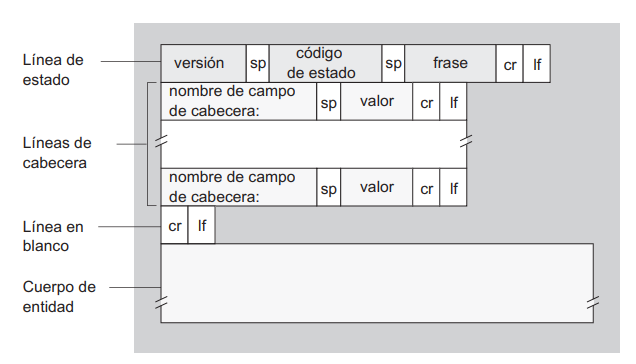
El mensaje de repsuesta tiene tres secciones: 
 - **Línea de estado inicial**: en el que se especifica la versión del protocolo, el código de estado y el mensaje explicativo del mensaje.

    ``` bash
    HTTP/1.1 200 OK
    ```
**Líneas de cabecera:** 

``` python
Connection: close # indica al cliente que va a cerrar la conexión TCP después de enviar el mensaje
Date: Sat, 07 Jul 2007 12:00:15 GMT # En que momento se creó la respuesta y fue enviada por el servidor
Server: Apache/1.3.0 (Unix) # mensaje generador por un servidor - análoga a User-agent
Last-Modified: Sun, 6 May 2007 09:23:24 GMT # especifica cuando el objeto fue creado o modificado por última vez 
Content-Length: 6821 # número de bytes del objeto que está siendo  enviado
Content-Type: text/html # indica el tipo de objeto 
```
- **Cuerpo de entidad:** contiene el objeto solicitado.

#### c. Suponga que desea enviar un requerimiento con la versión de HTTP 1.1 desde curl/7.74.0 a un sitio de ejemplo como www.misitio.com para obtener el recurso /index.html. En base a lo indicado, ¿qué información debería enviarse mediante encabezados? Indique cómo quedaría el requerimiento.

```
GET /index.html HTTP/1.1 
Host: www.misitio.com
Conecction: close 
User-agent: curl/7.74.0
Accept-language: es
```

### 7. Utilizando la VM, abra una terminal e investigue sobre el comando curl. Analice para qué sirven los siguientes parámetros (-I,-H,-X,-s). 
Resumen:
    -I: Obtiene solo los encabezados de respuesta.
    -H: Agrega encabezados personalizados.
    -X: Especifica el método HTTP.
    -s: Silencia la salida estándar.
    -v: verbose. 
Detalle: 
- **-I (o --head)**: Este parámetro le dice a curl que realice una solicitud HTTP HEAD en lugar de GET. En otras palabras, en lugar de descargar el contenido completo de una página web, solo se obtienen los encabezados de respuesta (como el código de estado, tipo de contenido, etc.). Es útil para verificar si un recurso está disponible o para extraer información específica de los encabezados sin descargar todo el contenido.
- **-H (o --header)**: sirve para agregar encabezados personalizados a la solicitud HTTP. Por ejemplo, si se desea enviar una solicitud con un encabezado de autenticación:
```curl
curl -H "Authorization: Bearer tu_token" https://api.example.com/data
``` 
- **-X (o --request)**: especifica el método HTTP que se desea utilizar en la solicitud. Por defecto, curl utiliza GET. 
```curl
curl -X POST --data "nombre=Juan&apellido=Pérez" https://example.com/procesar-formulario.php
```
- **-s (o --silent)**: silencia la salida estándar de curl. Es decir, no se verá el progreso ni los mensajes de error en la terminal. Es útil cuando deseas ejecutar curl desde un script o automatizar tareas sin que la salida interfiera.

### 8. Ejecute el comando curl sin ningún parámetro adicional y acceda a www.redes.unlp.edu.ar. Luego responda: 
#### a. ¿Cuántos requerimientos realizó y qué recibió? Pruebe redirigiendo la salida (>) del comando curl a un archivo con extensión html y abrirlo con un navegador. 
Se realizaron 4989 requerimientos y se recibieron 4989
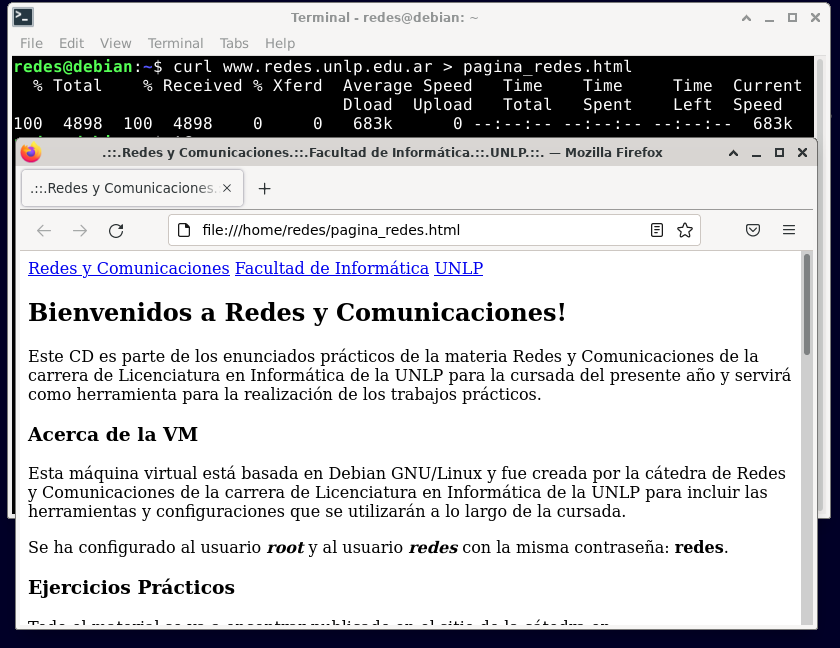

#### b. ¿Cómo funcionan los atributos href de los tags link e img en html? 
El atributo href en la etiqueta `<link>` se utiliza para enlazar recursos externos y el atributo src en la etiqueta `` se utiliza para especificar la ubicación de la imagen que se mostrará en la página. 

#### c. Para visualizar la página completa con imágenes como en un navegador, ¿alcanza con realizar un único requerimiento? 
No, no alcanza con un único requerimiento. Cada recurso, como un archivo CSS, un archivo JavaScript o una imagen, se solicita por separado al servidor. 

#### d. ¿Cuántos requerimientos serían necesarios para obtener una página que tiene dos CSS, dos Javascript y tres imágenes? Diferencie cómo funcionaría un navegador respecto al comando curl ejecutado previamente. 
Si el HTML tiene algún atributo href también se realizarán los requerimientos correspondientes para cada atributo. curl solo realizará un solo requerimiento (el archivo base HTML), requiere solicitudes manuales. 

### 9. Ejecute a continuación los siguientes comandos: 
```curl
curl -v -s www.redes.unlp.edu.ar > /dev/null 
```
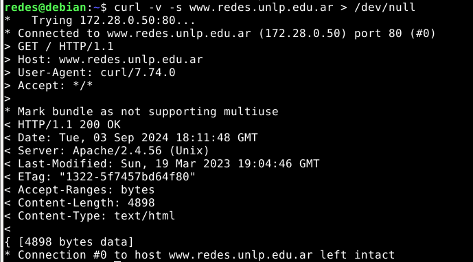
```
curl -I -v -s www.redes.unlp.edu.ar
```
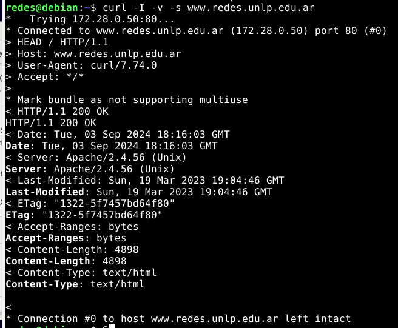
#### a. ¿Qué diferencias nota entre cada uno? 
En principio se ven iguales, es decir, ambos permiten tener las cabeceras de la respuesta HTTP(headers) sin embargo el comando 1 realiza una solicitud HTTP completa al servidor en la URL especificada (www.redes.unlp.edu.ar), pero redirige la salida (el contenido del cuerpo de la respuesta) a /dev/null, lo que significa que descarta todo el contenido del cuerpo de la respuesta. En el caso del comando 2 realiza una solicitud HTTP a la misma URL, pero solo solicita las cabeceras de la respuesta, no el cuerpo.

#### b. ¿Qué ocurre si en el primer comando se quita la redirección a `/dev/null?` ¿Por qué no es necesaria en el segundo comando? 
En el caso de que se quite la redirección mostrará el cuerpo de la respuesta (el contenido HTML de la página) en la terminal y nada se descartará (no se redirige la salida a `/dev/null`). 
No es necesaria en el segundo comando porque el `-I` (o `--head`) hace que curl solicite sólo las cabeceras de la respuesta y no el cuerpo, entonces no es necesario descartar nada. 

#### c. ¿Cuántas cabeceras viajaron en el requerimiento? ¿Y en la respuesta? 
En el requerimiento viajaron 4 cabeceras (incluyendo GET /HTTP/1.1)
En el caso de la respuesta hay 8 cabeceras (incluyendo HTTP/1.1 200 OK)

### 10. ¿Qué indica la cabecera Date? 
La cabecera Date indica la fecha y hora en la que el servidor envió la respuesta. Será util esta información para el caching (compara esta fecha con otras cabeceras como `last-modified`)

### 11. En HTTP/1.0, ¿cómo sabe el cliente que ya recibió todo el objeto solicitado de manera completa? ¿Y en HTTP/1.1? 
En **HTTP/1.0** no existía un mecanismo estándar para indicar el final del contenido. Pero tenía métodos:
1. Cierre de la conexión: que el servidor cierre la conexión TCP. Después de enviar el cuerpo de la respuesta, el servidor cerraba la conexión entonces el cliente lo detectaba. Ineficiente para múltiples solicitudes sucesivas ya que la no podía reutilizar la conexión. Relacionado con el encabezado `Connection` que puede tomar los valores `Connection: Keep-Alive` o `Connection: close` 
2. Cabecera `Content-Length`: se especificaba la longitud exacta del cuerpo de la respuesta en bytes, entonces el cliente una vez que había recibido esa cantidad de datos, sabía que había recibido todo el objeto. Tenía como limitación que la cabecera podía omitirse o ser imprecisa. 

En el caso de **HTTP/1.1**: 
1. Cabecera `Content-Length`: Se sigue utilizando para indicar la longitud del cuerpo ya que todas las mensajes de respuesta incluyen la cabecera. 
2. Transfer-Encoding `chunked`: permite que el servidor envíe una respuesta en "chunks" de tamaño variable, cada fragmento se precede con su tamaño en hexadecimal hasta que la transferencia termina cuando se envía un fragmento de tamaño cero. 
3. Conexiones persistentes: este protocolo lo usa por defecto, la conexión TCP no se cierra inmediatamente después de enviar una respuesta y se utilizan las cabeceras anteriormente mencionadas, lo que permite mantener la conexión abierta para solicitudes futuras.
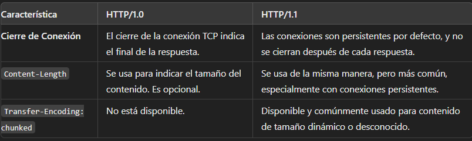

### 12. Investigue los distintos tipos de códigos de retorno de un servidor web y su significado. Considere que los mismos se clasifican en categorías (2XX, 3XX, 4XX, 5XX). 
- Respuestas informativas (100–199): el servidor ha recibido la petición y procederá con ella,
- Respuestas satisfactorias (200–299): el servidor ha recibido, entendido y procesado la solicitud correctamente,
- Redirecciones (300–399): el servidor ha recibido la solicitud, pero hay una redirección a alguna otra parte,
- Errores de los clientes (400–499): el servidor no puede encontrar (o alcanzar) la página o la web. Se trata de un error del lado de la web,
- y errores de los servidores (500–599): el cliente ha realizado una solicitud válida, pero el servidor ha fallado al completarla.

### 13. Utilizando curl, realice un requerimiento con el método HEAD al sitio www.redes.unlp.edu.ar e indique: 
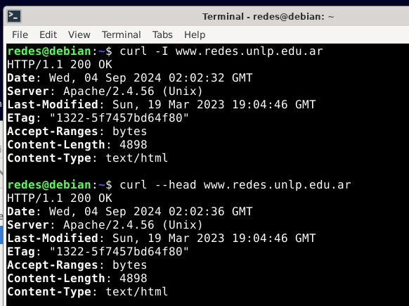
#### a. ¿Qué información brinda la primera línea de la respuesta? 
Es la **línea de estado**. Indica el protocolo, el estado y el mensaje. 
#### b. ¿Cuántos encabezados muestra la respuesta? 
La respuesta indica 7 encabezados. 
#### c. ¿Qué servidor web está sirviendo la página?
Apache/2.4.56 (Unix)
#### d. ¿El acceso a la página solicitada fue exitoso o no? 
Sí, por el status code 200.
#### e. ¿Cuándo fue la última vez que se modificó la página? 
La última vez que se modificó la página está dada por el header `Last-Modified: Sun, 19 Mar 2023 19:04:46 GMT`
#### f. Solicite la página nuevamente con curl usando GET, pero esta vez indique que quiere obtenerla sólo si la misma fue modificada en una fecha posterior a la que efectivamente fue modificada. ¿Cómo lo hace? ¿Qué resultado obtuvo? ¿Puede explicar para qué sirve? 
Es mediante el uso de GET Condicional. 
Entonces el comando necesario es:
```curl
curl -v -H "If-Modified-Since: Fri, 01 Sep 2023 00:00:00 GMT <Date>" www.redes.unlp.edu.ar
```
Si el contenido de la URL fue modificado después de esa fecha, curl te devolverá el contenido, en caso contrario se recibirá una respuesta con el código de estado `304 Not Modified` y no se incluirá el cuerpo del contenido en la respuesta. 
### 14. Utilizando curl, acceda al sitio www.redes.unlp.edu.ar/restringido/index.php y siga las instrucciones y las pistas que vaya recibiendo hasta obtener la respuesta final. Será de utilidad para resolver este ejercicio poder analizar tanto el contenido de cada página como los encabezados. 
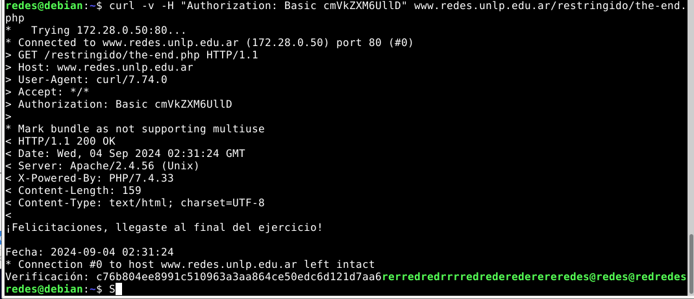
El método de autenticación "Basic" en HTTP es una forma simple de autenticar a los usuarios utilizando credenciales. Se utiliza en combinación con HTTPS para mayor seguridad. 
El encabezado `Location` en HTTP se utiliza para redirigir al cliente a una ubicación diferente el cual éste debe realizar una nueva solicitud a la dirección indicada.

### 15. Utilizando la VM, realice las siguientes pruebas: 
#### a. Ejecute el comando ’curl www.redes.unlp.edu.ar/extras/prueba-http-1-0.txt’ y copie la salida completa (incluyendo los dos saltos de línea del final). 
#### b. Desde la consola ejecute el comando telnet www.redes.unlp.edu.ar 80 y luego pegue el contenido que tiene almacenado en el portapapeles. ¿Qué ocurre luego de hacerlo? 
Se visualiza todo el contenido. 
#### c. Repita el proceso anterior, pero copiando la salida del recurso /extras/prueba-http-1-1.txt. Verifique que debería poder pegar varias veces el mismo contenido sin tener que ejecutar el comando telnet nuevamente. 
La conexión no se cierra una vez el servidor envía la respuesta. Tiene un tardío. 

### 16. En base a lo obtenido en el ejercicio anterior, responda: 
#### a. ¿Qué está haciendo al ejecutar el comando telnet? 
Telnet es un protocolo de red que permite a un usuario conectarse a otro dispositivo en la red. Fue uno de los primeros protocolos de internet diseñados para comunicaciones remotas. 
```
telnet www.redes.unlp.edu.ar 80 #Puerto al que se conectará con el servidor
```
Sirve para pruebas de conectividad, administración remota y depurar problemas de red. 

#### b. ¿Qué método HTTP utilizó? ¿Qué recurso solicitó? 
Utilizó el método GET. Se solicitó el recurso /http/HTTP-1.1/ .

#### c. ¿Qué diferencias notó entre los dos casos? ¿Puede explicar por qué? 
La diferencia radica en que la conexión no se cierra una vez que el servidor envía la respuesta. Se debe a que con HTTP 1.0 cada solicitud requiere abrir y cerrar una nueva conexión, en cambio con HTTP 1.1 una sola conexión puede ser reurilizada para varias transacciones. 

#### d. ¿Cuál de los dos casos le parece más eficiente? Piense en el ejercicio donde analizó la cantidad de requerimientos necesarios para obtener una página con estilos, javascripts e imágenes. El caso elegido, ¿puede traer asociado algún problema? 
Es más eficiente el caso de HTTP1.1 ya que reduce la sobrecarga asociada con la apertuara y el cierre de conexiones. 
Hay un problema asociado con la conexión persistente. Si un recurso se mantiene en la conexión durante un periodo prolongado, podría bloquear la conexión y retrasar la obtención de otros recursos (_holgura de cabeza_). No olvidar que se aplica pipelining.

### 17. En el siguiente ejercicio veremos la diferencia entre los métodos POST y GET. Para ello, será necesario utilizar la VM y la herramienta Wireshark. Antes de iniciar considere:

- Capture los paquetes utilizando la interfaz con IP 172.28.0.1. (Menú “Capture->Options”. Luego seleccione la interfaz correspondiente y presione Start).
- Para que el analizador de red sólo nos muestre los mensajes del protocolo http introduciremos la cadena ‘http’ (sin las comillas) en la ventana de especificación de filtros de visualización (display-filter). Si no hiciéramos esto veríamos todo el tráfico que es capaz de capturar nuestra placa de red. De los paquetes que son capturados, aquel que esté seleccionado será mostrado en forma detallada en la sección que está justo debajo. Como sólo estamos interesados en http ocultaremos toda la información que no es relevante para esta práctica (Información de trama, Ethernet, IP y TCP). Desplegar la información correspondiente al protocolo HTTP bajo la leyenda “Hypertext Transfer Protocol”. 
- Para borrar la cache del navegador, deberá ir al menú “Herramientas->Borrar historial reciente”. Alternativamente puede utilizar Ctrl+F5 en el navegador para forzar la petición HTTP evitando el uso de caché del navegador. 
- En caso de querer ver de forma simplificada el contenido de una comunicación http, utilice el botón derecho sobre un paquete HTTP perteneciente al flujo capturado y seleccione la opción Follow TCP Stream
    a. Abra un navegador e ingrese a la URL: www.redes.unlp.edu.ar e ingrese al link en la sección “Capa de Aplicación” llamado “Métodos HTTP”. En la página mostrada se visualizan dos nuevos links llamados: Método GET y Método POST. Ambos muestran un formulario como el siguiente:
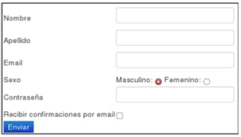
    b. Analice el código HTML. 

    c. Utilizando el analizador de paquetes Wireshark capture los paquetes enviados y recibidos al presionar el botón Enviar. 
    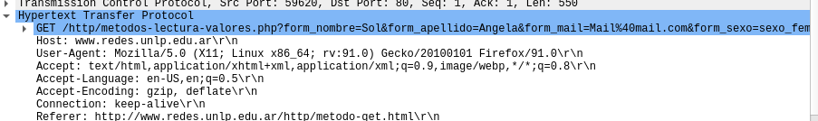 
_Mensaje de solicitud al presionar el botón con el método GET._
    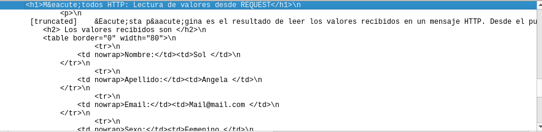
_Parte del mensaje de respuesta al presionar el botón con el método GET._

    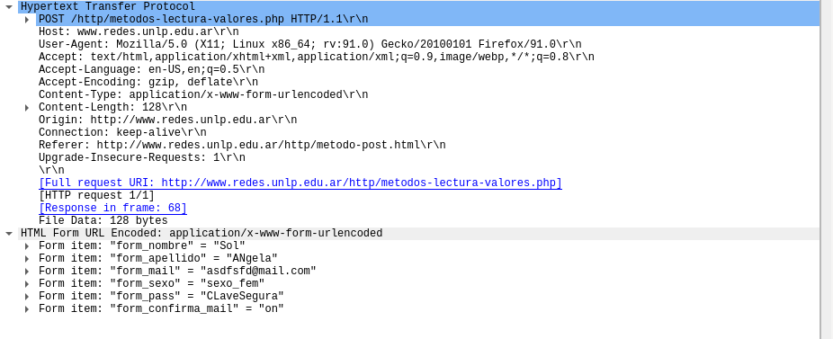
_Mensaje de solicitud al presionar el botón con el método POST_

    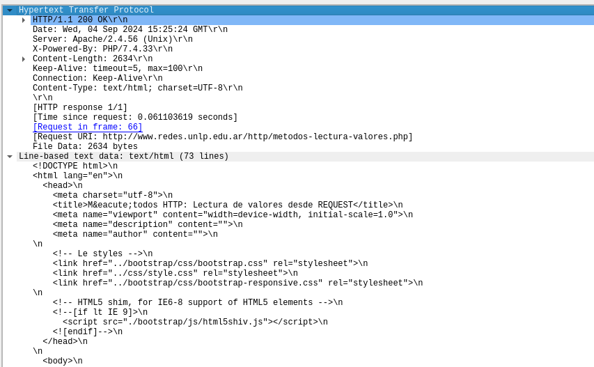
_Mensaje de respuesta al presionar el botón con el método POST_ 

    d. ¿Qué diferencias detectó en los mensajes enviados por el cliente?

    e. Oberservó alguna diferencia a en el browser si se utiliza un mensaje u otro?


### 18. Investigue cuál es el principal uso que se le da a las cabeceras Set-Cookie y Cookie en HTTP y qué relación tienen con el funcionamiento del protocolo HTTP.
`Set-Cookie` es una cabecera de respuesta que se usa para enviar cookies desde el servidor al agente de usuario, así el agente de usuario puede enviarlos de vuelta el servidor. 
El encabezado `Cookie` de una solicitud HTTP contiene cookie HTTP almacenadas y enviadas previamente por el servidor con el encabezado (**header**). 
Las cookies se utilizan para crear una capa de sesión sobre el protocolo HTTP, que de por sí no tiene estado de conexión. 

### 19. ¿Cuál es la diferencia entre un protocolo binario y uno basado en texto? ¿De qué tipo de protocolo se trata HTTP/1.0, HTTP/1.1 y HTTP/2?
La diferencia es la forma en que los datos son codificados y transmitidos. 
En el caso del **protocolo basado en texto** es un formato legible y los mensajes pueden ser inspeccionados facilmente sin emcargo, tiene a ser menos eficiente por el tiempo de procesamiento. Ejemplos: HTTP/1.0 y HTTP/1.1 
Para los **procotolos binarios** los mensajes están codificados en formato binario (bytes) lo que lo hace más compacto en términos de transmisión y procesamiento ya que hay menor sobrecarga de datos.  

### 20. Responder las siguientes preguntas: 
#### a. ¿Qué función cumple la cabecera Host en HTTP 1.1? ¿Existía en HTTP 1.0? ¿Qué sucede en HTTP/2? (Ayuda: https://undertow.io/blog/2015/04/27/An-in-depth-overview-of-HTTP2.html para HTTP/2)
La cabecera `Host` se utiliza para especificar el nombre del dominio del servidor al que se le está realizando la solicitud. Un solo servidor puede alojar múltiples dominios (_hosting virtual_) entonces la cabecera le permite al servidor indentificar cuál de los sitios debe gestionar la solicitud. 

En HTTP/1.0 no existía la cabecera `Host`.

En el caso de HTTP/2 el tag sigue presente pero es reemplazada por `:authority` que proporciona el valor del host y puerto del servidor al que se dirige la solicitud.  

#### b. En HTTP/1.1, ¿es correcto el siguiente requerimiento? 
```
GET /index.php HTTP/1.1 
User-Agent: curl/7.54.0
```
Falta la cabecera `HOST` que es obligatoria en HTTP/1.1 

#### c. ¿Cómo quedaría en HTTP/2 el siguiente pedido realizado en HTTP/1.1 si se está usando https? 
```
GET /index.php HTTP/1.1
Host: www.info.unlp.edu.ar
``` 
Quedaría de la siguiente manera:
```
:method: Get
:path: /index.php
:scheme: https
:authority: www.info.unlp.edu.ar
```

**:method:** Indica el método HTTP que se está utilizando (en este caso, GET).
**:path:** Especifica la ruta del recurso solicitado (/index.php).
**:scheme:** Indica el esquema utilizado en la conexión, que puede ser http o https. En este caso es https porque estás utilizando una conexión segura.
**:authority:** Reemplaza la cabecera Host de HTTP/1.1. Es obligatoria y especifica el nombre del host (y opcionalmente el puerto), que en este caso es www.info.unlp-edu.ar.

---

## Arquitecturas de las aplicaciones de red 
Se establece cómo la aplicación debe estructurarse en los distintos sistemas terminales. Existen dos arquitecturas predominantes para aplicaciones de red: cliente-servidor y peer-to-peer (P2P).

**Arquitectura cliente-servidor**: Un servidor central siempre activo atiende solicitudes de múltiples clientes. Los clientes no se comunican entre sí y el servidor tiene una dirección IP fija. Esta arquitectura es común en aplicaciones como la web, FTP, y correo electrónico. Sin embargo, puede requerir infraestructura intensiva, como centros de datos (agrupación de hosts o _cluster_), para manejar grandes volúmenes de solicitudes.

**Arquitectura P2P**: Los peers (pares) se comunican directamente sin necesidad de un servidor central, lo que reduce la dependencia de infraestructura costosa. Esta arquitectura es común en aplicaciones de distribución de archivos, telefonía por Internet, y IPTV. Las aplicaciones P2P son auto-escalables y tienen una buena relación coste-prestaciones, pero enfrentan desafíos como la presión sobre los ISP, seguridad y la necesidad de incentivos para que los usuarios compartan recursos.

---
## Problemas del libro 
### ¿Verdadero o falso?
a. Un usuario solicita una página web que consta de texto y tres imágenes. Para obtener esa página, el cliente envía un mensaje de solicitud y recibe cuatro mensajes de respuesta.
Falso. Uno por cada recurso. 
b. Dos páginas web diferentes (por ejemplo, www.mit.edu/research.html y www.mit.edu/students.html) se pueden enviar a través de la misma conexión persistente.
Verdadero. 
c. Con las conexiones no persistentes entre un navegador y un servidor de origen, un único segmento TCP puede transportar dos mensajes de solicitud HTTP distintos. Falsa. Necesitaría un  segmento por cada mensaje. 
d. La línea de cabecera Date: del mensaje de respuesta HTTP indica cuándo el objeto fue modificado por última vez. Falsa, el encabezado es last modified. 
e. Los mensajes de respuesta HTTP nunca incluyen un cuerpo de mensaje vacío. Falsa. Caso método HEAD

---
- Diferencia entre las versiones del http. 
- curl es más amplio.
- telnet servirá para comunicación con otro sistema terminal que también usará telnet. 
- Es una herramienta para hacer conexiones TCP por eso manualmente se debe armar el encabezado a diferencia de curl. 
- Las primeras líneas no cuentan como líneas de cabecera. 
---
## Ejercicio de parcial
```
curl-X ?? 
www.redes.unlp.edu.ar/?? 
> HEAD /metodos/ HTTP/?? 
> Host: www.redes.unlp.edu.ar 
> User-Agent: curl/7.54.0 

< HTTP/?? 200 OK 
< Server: nginx/1.4.6 (Ubuntu) 
< Date: Wed, 31 Jan 2018 22:22:22 GMT 
< Last-Modified: Sat, 20 Jan 2018 13:02:41 GMT 
< Content-Type: text/html; charset=UTF-8 
< Connection: close #Por este motivo podría ser 1.1 ya que forzaría el cierre de conexión. 
```

### a. ¿Qué versión de HTTP podría estar utilizando el servidor?
Podría estar usando el protocolo HTTP/1.0 o el HTTP/1.1 (en este último es obligatorio el encabezado host) 
Revisar `content-length` (No es necesario, porque es un método HEAD, no un GET). 
### b. ¿Qué método está utilizando? Dicho método, ¿retorna el recurso completo solicitado? 
Está usando el método `HEAD` que NO retorna el recurso solicitado, unicamente los encabezados. 
### c. ¿Cuál es el recurso solicitado? 
Es el recurso /metodos  de tipo text/html 
### d. ¿El método funcionó correctamente? 
Sí, por el codigo de estado 200.
### e. Si la solicitud hubiera llevado un encabezado que diga:
```
If-Modified-Since: Sat, 20 Jan 2018 13:02:41 GMT 
```
¿Cuál habría sido la respuesta del servidor web? ¿Qué habría hecho el navegador en este caso? 

---
Entonces, al ser un método HEAD pedirá los encabezados, lo que va a importar será el codigo de estado. En caso de haya sido un GET ele navegador podría pedir el recurso en su caché. 
Si no fue modificado desde esa fecha se recibe el código 304, caso contrario se recibe un 200 con el cuerpo del mensaje (si es un GET)

---

Para saber qué métodos acepta el servidor se usa el `OPTION`. 