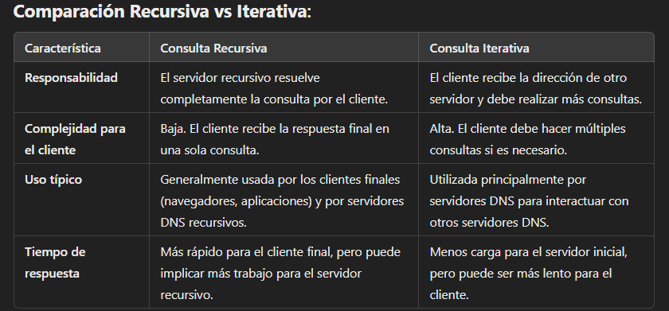
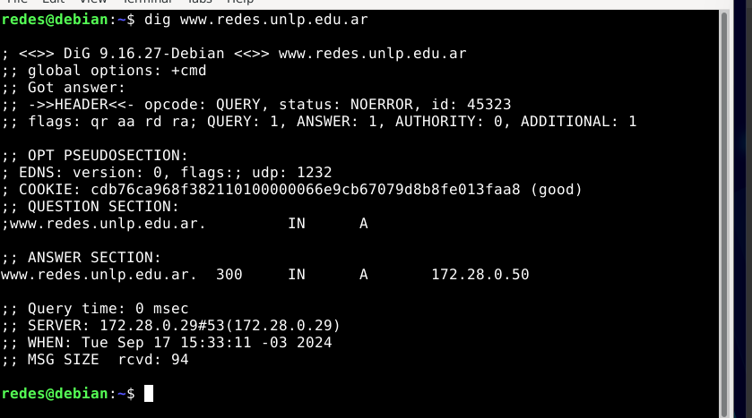

# Practica 3 - DNS

## Introducción

### 1. Investigue y describa cómo funciona el DNS. ¿Cuál es su objetivo? 
El objetivo principal es el de traducir nombres de dominio a direcciones IP para lograr una abstracción de las direcciones de red utilizadas internamente por los protocolos. Permite así ubicar a un dispositivo por su nombre sin importar cuál es su dirección IP actual. 
Funciona como un sistema distribuido de forma jerárquica, a través de dominios, sub-dominios y nombres finales, con un conjunto de servidores a lo largo del mundo.  
### 2. ¿Qué es un root server? ¿Qué es un generic top-level domain (gtld)? 
Los root servers son los encargados de proporcionar las direcciones IP de los Top Level Domains. Los root servers no tienen la dirección IP del dominio solicitado, pero dirigen la consulta al servidor adecuado para los **dominios de nivel superior (TLD)** como `.com`, `.net`.
Actualmente, hay 13 conjuntos de root servers, identificados con letras de la A a la M (A.root-servers.net, B.root-servers.net, etc.).

un gTLD es un tiop de dominio de nivel superior en el sistema DNS que no está vinculado a una ubicación geográfica específica, sino que tiene un propósito más genérico (`.com`, `.org`, `.net`). Son gestionados y regulados por organizaciones aprobadas por la ICANN. 
### 3. ¿Qué es una respuesta del tipo autoritativa? 
Una **respuesta autoritativa** es aquella dada por el servidor que tiene la autoridad sobre el nombre que se está consultando. Proviene de un servidor DNS autoritativo el cual tiene la información exacta y oficial sobre un dominio específico y sus registros DNS, como las direcciones IP asociadas. 
En una consulta DNS las respuestas autoritativas son marcadas como tales por el campo "AA" (_Authoritative Answer_) en la respuesta. 
### 4. ¿Qué diferencia una consulta DNS recursiva de una iterativa? 
**Consulta recursiva**: el servidor DNS consultado se encarga de resolver toda la consulta en nombre del cliente, realizando consultas adicionales si es necesario y proporcionando una respuesta completa y devolverla al cliente. 
**Consulta iterativa**: el cliente recibe una respuesta parcial en cada paso y debe seguir consultando diferentes servidores DNS hasta obtener una respuesta final. En lugar de recibir la respuesta completa de un solo servidor, el cliente recibe indicaciones sobre a quién consultar a continuación. 


### 5. ¿Qué es el resolver? CONSULTAR
El **Resolver** actúa como un intermediario entre un cliente y los servidores DNS. 
El **stub resolver** envía una consulta DNS al servidor DNS recursivo y espera una respuesta final. No resuelve directamente el nombre de dominio, solo hace una petición a otro servidor queh ará el trabajo por él. 
El **recursive resolver** recibe la consulta del stub resolver y se encarga de realizar todo el proceso de resolución que puede incluir consultas amúltiples servidores DNS hasta obtener la dirección IP final. Este tipo de resolver hace consultas recursivas en nombre del cliente y devuelve una respuesta completa. El resolver revisa su caché local para ver si ya tiene la respuesta a la consulta. Si tiene la respuesta, la devuelve al cliente sin necesidad de nuevas consultas. Caso contrario, envía una consulta al servidor raíz, que le dirá a qué servidor TLD acudir. 

### 6. Describa para qué se utilizan los siguientes tipos de registros de DNS: 
a. A    f. NS 
b. MX   g. CNAME
c. PTR  h. SOA
d. AAAA i.TXT
e. SRV   

Cada mensaje de respuesta DNS transporta uno o más registros de recursos que está formado por los siguientes cuatro campos: 
`(nombre, valor, tipo, TTL)`
TTL es el tiempo de vida del registro de recurso: determina cuándo un recurso debería ser eliminado de una caché. 
Tanto _nombre_ como _valor_ dependen del _tipo_
- Tipo = A: nombre es un nombre de host y valor es la dirección IP correspondiente a dicho nombre. Mapea a una dirección IPv4.
```
    (relay1.bar.foo.com, 145.37.93.126, A)
```

- Tipo = MX: el nombre es un alias de un servidor de correo y el valor es su nombre canónico. 
```
 (foo.com, mail.bar.foo.com, MX)
```

- Tipo = PTR: mapean direcciones IP a nombres de dominio. Son el inverso de los registros (A). Trabajan en el dominio especial in-addr.arpa

- Tipo = AAAA: mapean un nombre de dominio a una dirección IPv6

- Tipo = SRV: Se utilizan para asociar servicios o recuerdos a nombres de dominio. 

- Tipo = NS: nombre es un dominio y valor el nombre de host de un servidor DNS autoritativo que sabe cómo obtener las direcciones IP de los hosts del dominio. No hay prioridad, todos los servidores tienen la misma precedencia. 
```
(foo.com, dns.foo.com, NS)
```

- Tipo = CNAME: valor es un nombe de host canónico correspondiente al alias especificado por nombre. 
```
(foo.com, relay1.bar.foo.com, CNAME)
```

- Tipo = SOA: proporciona información autoritativa sobre una zona de dominio, lo que incluye información sobre la administración y configuración de esa zona. Solo se admite un registro SOA por zona. Permite que servidores autoritarios de la misma zona se puedan sincronizar. 

- Tipo = TXT: mapean de un nombre de dominio a información extra asociada con el equipo que tiene dicho nombre, por ejemplo, pueden indicar finalidad, usuarios, etc. No son usados habitualmente. 

### 7. En Internet, un dominio suele tener más de un servidor DNS, ¿por qué cree que esto es así? 
Para que se pueda acceder lo más rápido posible: mejora la velocidad de resolución al servir a usuarios más cercanos; para que haya redundancia y disponibilidad: en caso de que un servidor falle se tiene otro como "backup"; para que haya distribución de carga: en caso de que un servidor sea muy consultado, se evita la sobrecarga en un solo servidor.

### 8. Cuando un dominio cuenta con más de un servidor, uno de ellos es el primario (o maestro) y todos los demás son secundarios (o esclavos). ¿Cuál es la razón de que sea así? 
Es para simplificar la configuración de los servidores autoritativos, evitando configurar a cada servidor de un mismo dominio de forma independiente. Se basa en la necesidad de gestionar la consistencia, actualización y redundancia de los registros DNS de forma eficiente.
Entonces, se configura aquel que es primario y el resto de los servidores se sincronizan con este. 

### 9. Explique brevemente en qué consiste el mecanismo de transferencia de zona y cuál es su finalidad. 
Es el proceso mediante el cual un servidor DNS secundario obtiene una copia completa de la base de datos de DNS de un servidor DNS primario. 
Permite que los servidores secundarios reciban actualizaciones de manera oportuna, mejora la disponibilidad del servicio DNS al garantizar que, si el servidor primario falla, los secundarios pueden seguir resolviendo las consultas. 

### 10. Imagine que usted es el administrador del dominio de DNS de la UNLP (unlp.edu.ar). A su vez, cada facultad de la UNLP cuenta con un administrador que gestiona su propio dominio (por ejemplo, en el caso de la Facultad de Informática se trata de info.unlp.edu.ar). Suponga que se crea una nueva facultad, Facultad de Redes, cuyo dominio será redes.unlp.edu.ar, y el administrador le indica que quiere poder manejar su propio dominio. ¿Qué debe hacer usted para que el administrador de la Facultad de Redes pueda gestionar el dominio de forma independiente? (Pista: investigue en qué consiste la delegación de dominios). Indicar qué registros de DNS se deberían agregar.

Debería delegar la autoridad para el subdominio. Esto se realiza mendiante registros de tipo **NS (Name Server)** en el servidor DNS del dominio superior, en este caso `unlp.edu.ar` debe añadir registros NS para el nuevo subdominio `redes.unlp.edu.ar` que apunten a los servidores DNS responsables del subdominio. 
Además de los registros NS, se deben agregar registros **A** (o *AAAA*) para los nombres de los servidores DNS para proporcionar las direcciones IP de los servidores DNS delegados.

### 11. Responda y justifique los siguientes ejercicios. 
**a. En la VM, utilice el comando dig para obtener la dirección IP del host www.redes.unlp.edu.ar y responda:** 



i. ¿La solicitud fue recursiva? ¿Y la respuesta? ¿Cómo lo sabe?
_falta completar_ Por flag rd y ra 

ii. ¿Puede indicar si se trata de una respuesta autoritativa? ¿Qué significa que lo sea? 
Por el flag `aa` podemos determinar que sí fue una respuesta autoritativa. 

iii. ¿Cuál es la dirección IP del resolver utilizado? ¿Cómo lo sabe?


b. ¿Cuáles son los servidores de correo del dominio redes.unlp.edu.ar? ¿Por qué hay más de uno y qué significan los números que aparecen entre MX y el nombre? Si se quiere enviar un correo destinado a redes.unlp.edu.ar, ¿a qué servidor se le entregará? ¿En qué situación se le entregará al otro? 
c. ¿Cuáles son los servidores de DNS del dominio redes.unlp.edu.ar? 
d. Repita la consulta anterior cuatro veces más. ¿Qué observa? ¿Puede explicar a qué se debe? 
e. Observe la información que obtuvo al consultar por los servidores de DNS del dominio. En base a la salida, ¿es posible indicar cuál de ellos es el primario? 
f. Consulte por el registro SOA del dominio y responda.
    i. ¿Puede ahora determinar cuál es el servidor de DNS primario? 
    ii. ¿Cuál es el número de serie, qué convención sigue y en qué casos es importante actualizarlo? 
    iii. ¿Qué valor tiene el segundo campo del registro? Investigue para qué se usa y cómo se interpreta el valor. 
    iv.¿Qué valor tiene el TTL de caché negativa y qué significa?
g. Indique qué valor tiene el registro TXT para el nombre saludo.redes.unlp.edu.ar. Investigue para qué es usado este registro. 
h. Utilizando dig, solicite la transferencia de zona de redes.unlp.edu.ar, analice la salida y responda.
    i. ¿Qué significan los números que aparecen antes de la palabra IN? ¿Cuál es su finalidad?
    ii. ¿Cuántos registros NS observa? Compare la respuesta con los servidores de DNS del dominio redes.unlp.edu.ar que dio anteriormente. ¿Puede explicar a qué se debe la diferencia y qué significa?
i. Consulte por el registro A de www.redes.unlp.edu.ar y luego por el registro A de www.practica.redes.unlp.edu.ar. Observe los TTL de ambos. Repita la operación y compare el valor de los TTL de cada uno respecto de la respuesta anterior. ¿Puede explicar qué está ocurriendo? (Pista: observar los flags será de ayuda). 
j. Consulte por el registro A de www.practica2.redes.unlp.edu.ar. ¿Obtuvo alguna respuesta? Investigue sobre los códigos de respuesta de DNS. ¿Para qué son utilizados los mensajes NXDOMAIN y NOERROR?


### 12. Investigue los comandos nslookup y host. ¿Para qué sirven? Intente con ambos comandos obtener:
- Dirección IP de www.redes.unlp.edu.ar. 
- Servidores de correo del dominio redes.unlp.edu.ar.
- Servidores de DNS del dominio redes.unlp.edu.ar.
### 13. ¿Qué función cumple en Linux/Unix el archivo `/etc/hosts` o en Windows el archivo `\WINDOWS\system32\drivers\etc\hosts`?
Se utiliza para la resolución de nombres de dominio. Su función principal es mapear nombres de host a direcciones IP sin necesidad de consultar un servidor DNS. 
En ese archivo puede definir manualmente direcciones IP y asociarlas con nombres de dominio específicos. 

```bash
127.0.0.1 miapp.local
```
de esta forma cualquier solicitud a `miapp.local` se resolverá a la dirección IP `127.0.0.1`  

### 14. Abra el programa Wireshark para comenzar a capturar el tráfico de red en la interfaz con IP 172.28.0.1. Una vez abierto realice una consulta DNS con el comando dig para averiguar el registro MX de redes.unlp.edu.ar y luego, otra para averiguar los registros NS correspondientes al dominio redes.unlp.edu.ar. Analice la información proporcionada por dig y compárelo con la captura.
### 15. . Dada la siguiente situación: “Una PC en una red determinada, con acceso a Internet, utiliza los servicios de DNS de un servidor de la red”. Analice:
```
a. ¿Qué tipo de consultas (iterativas o recursivas) realiza la PC a su servidor de DNS? 
b. ¿Qué tipo de consultas (iterativas o recursivas) realiza el servidor de DNS para resolver requerimientos de usuario como el anterior? ¿A quién le realiza estas consultas?
```
### 16. Relacione DNS con HTTP. ¿Se puede navegar si no hay servicio de DNS?
Sí, se podría navegar solo que sería necesario conocer la dirección IP del sitio web. 

### 17. Obserar el siguiente gráfico y contestar 

```
a. Si la PC-A, que usa como servidor de DNS a "DNS Server", desea obtener la IP de www.unlp.edu.ar, cuáles serían, y en qué orden, los pasos que se ejecutarán para obtener la respuesta. 
b. ¿Dónde es recursiva la consulta? ¿Y dónde iterativa?
```
### 18. ¿A quién debería consultar para que la respuesta sobre www.google.com sea autoritativa?

### 19. ¿Qué sucede si al servidor elegido en el paso anterior se lo consulta por www.info.unlp.edu.ar? ¿Y si la consulta es al servidor 8.8.8.8?

---
## De interés
Explica sobre flags en dig: https://blog.standalonecomplex.es/2010/05/16/guia-de-dig/ 