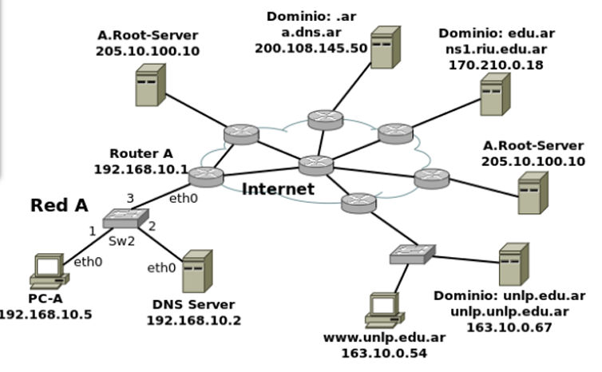

# Practica 3 - DNS

## Introducción

### 1. Investigue y describa cómo funciona el DNS. ¿Cuál es su objetivo? 
### 2. ¿Qué es un root server? ¿Qué es un generic top-level domain (gtld)? 
### 3. ¿Qué es una respuesta del tipo autoritativa? 
### 4. ¿Qué diferencia una consulta DNS recursiva de una iterativa? 
### 5. ¿Qué es el resolver?
### 6. Describa para qué se utilizan los siguientes tipos de registros de DNS: 
a. A    f. NS 
b. MX   g. CNAME
c. PTR  h. SOA
d. AAAA i.TXT
e. SRV   

### 7. En Internet, un dominio suele tener más de un servidor DNS, ¿por qué cree que esto es así? 
### 8. Cuando un dominio cuenta con más de un servidor, uno de ellos es el primario (o maestro) y todos los demás son secundarios (o esclavos). ¿Cuál es la razón de que sea así? 
### 9. Explique brevemente en qué consiste el mecanismo de transferencia de zona y cuál es su finalidad. 
### 10. Imagine que usted es el administrador del dominio de DNS de la UNLP (unlp.edu.ar). A su vez, cada facultad de la UNLP cuenta con un administrador que gestiona su propio dominio (por ejemplo, en el caso de la Facultad de Informática se trata de info.unlp.edu.ar). Suponga que se crea una nueva facultad, Facultad de Redes, cuyo dominio será redes.unlp.edu.ar, y el administrador le indica que quiere poder manejar su propio dominio. ¿Qué debe hacer usted para que el administrador de la Facultad de Redes pueda gestionar el dominio de forma independiente? (Pista: investigue en qué consiste la delegación de dominios). Indicar qué registros de DNS se deberían agregar.
### 11. Responda y justifique los siguientes ejercicios. 
```
a. En la VM, utilice el comando dig para obtener la dirección IP del host www.redes.unlp.edu.ar y responda: 
    i. ¿La solicitud fue recursiva? ¿Y la respuesta? ¿Cómo lo sabe? 
    ii. ¿Puede indicar si se trata de una respuesta autoritativa? ¿Qué significa que lo sea?
    iii. ¿Cuál es la dirección IP del resolver utilizado? ¿Cómo lo sabe?
b. ¿Cuáles son los servidores de correo del dominio redes.unlp.edu.ar? ¿Por qué hay más de uno y qué significan los números que aparecen entre MX y el nombre? Si se quiere enviar un correo destinado a redes.unlp.edu.ar, ¿a qué servidor se le entregará? ¿En qué situación se le entregará al otro? 
c. ¿Cuáles son los servidores de DNS del dominio redes.unlp.edu.ar? 
d. Repita la consulta anterior cuatro veces más. ¿Qué observa? ¿Puede explicar a qué se debe? 
e. Observe la información que obtuvo al consultar por los servidores de DNS del dominio. En base a la salida, ¿es posible indicar cuál de ellos es el primario? 
f. Consulte por el registro SOA del dominio y responda.
    i. ¿Puede ahora determinar cuál es el servidor de DNS primario? 
    ii. ¿Cuál es el número de serie, qué convención sigue y en qué casos es importante actualizarlo? 
    iii. ¿Qué valor tiene el segundo campo del registro? Investigue para qué se usa y cómo se interpreta el valor. 
    iv.¿Qué valor tiene el TTL de caché negativa y qué significa?
g. Indique qué valor tiene el registro TXT para el nombre saludo.redes.unlp.edu.ar. Investigue para qué es usado este registro. 
h. Utilizando dig, solicite la transferencia de zona de redes.unlp.edu.ar, analice la salida y responda.
    i. ¿Qué significan los números que aparecen antes de la palabra IN? ¿Cuál es su finalidad?
    ii. ¿Cuántos registros NS observa? Compare la respuesta con los servidores de DNS del dominio redes.unlp.edu.ar que dio anteriormente. ¿Puede explicar a qué se debe la diferencia y qué significa?
i. Consulte por el registro A de www.redes.unlp.edu.ar y luego por el registro A de www.practica.redes.unlp.edu.ar. Observe los TTL de ambos. Repita la operación y compare el valor de los TTL de cada uno respecto de la respuesta anterior. ¿Puede explicar qué está ocurriendo? (Pista: observar los flags será de ayuda). 
j. Consulte por el registro A de www.practica2.redes.unlp.edu.ar. ¿Obtuvo alguna respuesta? Investigue sobre los códigos de respuesta de DNS. ¿Para qué son utilizados los mensajes NXDOMAIN y NOERROR?
```
### 12. Investigue los comandos nslookup y host. ¿Para qué sirven? Intente con ambos comandos obtener:
- Dirección IP de www.redes.unlp.edu.ar. 
- Servidores de correo del dominio redes.unlp.edu.ar.
- Servidores de DNS del dominio redes.unlp.edu.ar.
### 13. ¿Qué función cumple en Linux/Unix el archivo /etc/hosts o en Windows el archivo \WINDOWS\system32\drivers\etc\hosts?
### 14. Abra el programa Wireshark para comenzar a capturar el tráfico de red en la interfaz con IP 172.28.0.1. Una vez abierto realice una consulta DNS con el comando dig para averiguar el registro MX de redes.unlp.edu.ar y luego, otra para averiguar los registros NS correspondientes al dominio redes.unlp.edu.ar. Analice la información proporcionada por dig y compárelo con la captura.
### 15. . Dada la siguiente situación: “Una PC en una red determinada, con acceso a Internet, utiliza los servicios de DNS de un servidor de la red”. Analice:
```
a. ¿Qué tipo de consultas (iterativas o recursivas) realiza la PC a su servidor de DNS? 
b. ¿Qué tipo de consultas (iterativas o recursivas) realiza el servidor de DNS para resolver requerimientos de usuario como el anterior? ¿A quién le realiza estas consultas?
```
### 16. Relacione DNS con HTTP. ¿Se puede navegar si no hay servicio de DNS?
### 17. Obserar el siguiente gráfico y contestar 

```
a. Si la PC-A, que usa como servidor de DNS a "DNS Server", desea obtener la IP de www.unlp.edu.ar, cuáles serían, y en qué orden, los pasos que se ejecutarán para obtener la respuesta. 
b. ¿Dónde es recursiva la consulta? ¿Y dónde iterativa?
```
### 18. ¿A quién debería consultar para que la respuesta sobre www.google.com sea autoritativa?

### 19. ¿Qué sucede si al servidor elegido en el paso anterior se lo consulta por www.info.unlp.edu.ar? ¿Y si la consulta es al servidor 8.8.8.8?