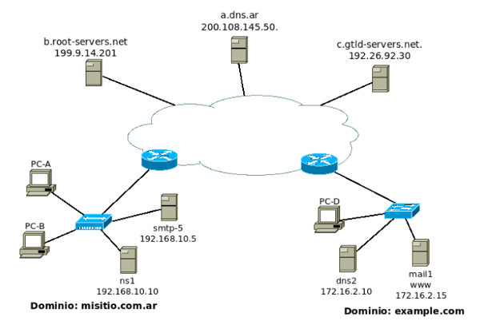

# Práctica 4: Correo electrónico

## 1. ¿Qué protocolos se utilizan para el envío de mails entre el cliente y su servidor de correo? ¿Y entre servidores de correo? 
Los protocolos que se utilizan para el envío de correos electrónicos son:

1. **Entre el cliente y su servidor de correo**: Se utilizan los protocolos **POP3 (Post Office Protocol versión 3)** o **IMAP (Internet Message Access Protocol)** para la recepción de los correos, y el **SMTP (Simple Mail Transfer Protocol)** para el envío desde el cliente al servidor de correo del emisor.

2. **Entre servidores de correo**: El protocolo **SMTP** es el principal protocolo utilizado para la transferencia de correos entre servidores de correo. Utiliza el servicio de transferencia de datos de TCP para transferir el correo desde el servidor de correo del emisor al servidor de correo del destinatario
SMTP tiene dos lados: el lado del cliente, que se ejecuta en el servidor de correo del emisor, y el lado del servidor, que se ejecuta en el servidor de correo del destinatario.
Tanto el lado del cliente como el del servidor de SMTP se ejecutan en todos los servidores de correo.
Cuando un servidor de correo envía mensajes de correo a otros servidores de correo, actúa como un cliente SMTP. Cuando un servidor de correo recibe correo de otros servidores, actúa como un servidor SMTP.

## 2. ¿Qué protocolos se utilizan para la recepción de mails? Enumere y explique características y diferencias entre las alternativas posibles.
Los protocolos principales para la recepción de mails son:
- POP3: permite que los correos sean descargados desde el servidor de correo al cliente (compu) eliminándolos del servidor por lo que no están disponibles para otros dispositivos. Ocupa menos espacio en el servidor.
- IMAP: gestiona los correos directamente en el servidor sin necesidad de descargarlos, sincronizando constantemente entre el servidor y los dispositivos. El usuario puede acceder desde múltiples dispositivos. Requiere más almacenamiento en el servidor y es más dependiente de la conexión a Internet.

En resumen: 
**POP3** descarga los correos y los elimina del servidor (por defecto), mientras que **IMAP** mantiene los correos en el servidor y permite acceso desde múltiples dispositivos.
**POP3** es más simple y eficiente en términos de almacenamiento en el servidor, mientras que **IMAP** ofrece mayor flexibilidad y sincronización de correos entre dispositivos.

## 3. Utilizando la VM y teniendo en cuenta los siguientes datos, abra el cliente de correo (Thunderbird) y configure dos cuentas de correo. Una de las cuentas utilizará POP para solicitar al servidor los mails recibidos para la misma mientras que la otra utilizará IMAP. Al crear cada una de las cuentas, seleccionar Manual config y luego de configurar las mismas según lo indicado, ignorar advertencias por uso de conexión sin cifrado.
```
● Datos para POP 
Cuenta de correo: alumnopop@redes.unlp.edu.ar 
Nombre de usuario: alumnopop 
Contraseña: alumnopoppass 
Puerto: 110 

● Datos para IMAP 
Cuenta de correo: alumnoimap@redes.unlp.edu.ar 
Nombre de usuario: alumnoimap 
Contraseña: alumnoimappass 
Puerto: 143 
● Datos comunes para ambas cuentas 
    Servidor de correo entrante (POP/IMAP): 
        • Nombre: mail.redes.unlp.edu.ar 
        • SSL: None 
        • Autenticación: Normal password 
        
    Servidor de correo saliente (SMTP): 
        • Nombre: mail.redes.unlp.edu.ar 
        • Puerto: 25 
        • SSL: None 
        • Autenticación: Normal password
```

**a. Verificar el correcto funcionamiento enviando un email desde el cliente de una cuenta a la otra y luego desde la otra responder el mail hacia la primera.**

**b. Análisis del protocolo SMTP**
i. Utilizando Wireshark, capture el tráfico de red contra el servidor de correo mientras desde la cuenta alumnopop@redes.unlp.edu.ar envía un correo a alumnoimap@redes.unlp.edu.ar 
ii. Utilice el filtro SMTP para observar los paquetes del protocolo SMTP en la captura generada y analice el intercambio de dicho protocolo entre el cliente y el servidor para observar los distintos comandos utilizados y su correspondiente respuesta. Ayuda: filtre por protocolo SMTP ysobre alguna de las líneas del intercambio haga click derecho y seleccione Follow TCP Stream. . .

**c. Usando el cliente de correo Thunderbird del usuario alumnopop@redes.unlp.edu.ar envíe un correo electrónico alumnoimap@redes.unlp.edu.ar el cual debe tener: un asunto, datos en el body y una imagen adjunta.**
i. Verifique las fuentes del correo recibido para entender cómo se utiliza el header “Content-Type: multipart/mixed“ para poder realizar el envío de distintos archivos adjuntos.
ii. Extraiga la imagen adjunta del mismo modo que lo hace el cliente de correo a partir de los fuentes del mensaje.

## 4. Análisis del protocolo POP 
**a. Utilizando Wireshark, capture el tráfico de red contra el servidor de correo mientras desde la cuenta alumnoimap@redes.unlp.edu.ar le envía una correo a alumnopop@redes.unlp.edu.ar y mientras alumnopop@redes.unlp.edu.ar recepciona dicho correo.**
**b. Utilice el filtro POP para observar los paquetes del protocolo POP en la captura generada y analice el intercambio de dicho protocolo entre el cliente y el servidor para observar los distintos comandos utilizados y su correspondiente respuesta.**

## 5. Analisis del protocolo IMAP
**a. Utilizando Wireshark, capture el tráfico de red contra el servidor de correo mientras desde la cuenta alumnopop@redes.unlp.edu.ar le envía un correo a alumnoimap@redes.unlp.edu.ar y mientras alumnoimap@redes.unlp.edu.ar recepciona dicho correo.**

**b. Utilice el filtro IMAP para observar los paquetes del protocolo IMAP en la captura generada y analice el intercambio de dicho protocolo entre el cliente y el servidor para observar los distintos comandos utilizados y su correspondiente respuesta.**

## 6. IMAP vs POP 
**a. Marque como leídos todos los correos que tenga en el buzón de entrada de alumnopop y de alumnoimap. Luego, cree una carpeta llamada POP en la cuenta de alumnopop y una llamada IMAP en la cuenta de alumnoimap. Asegúrese que tiene mails en el inbox y en la carpeta recientemente creada en cada una de las cuentas.**

**b. Cierre la sesión de la máquina virtual del usuario redes e ingrese nuevamente identificándose como usuario root y password packer, ejecute el cliente de correos. De esta forma, iniciará el cliente de correo con el perfil del superusuario (diferente del usuario con el que ya configuró las cuentas antes mencionadas). Luego configure las cuentas POP e IMAP de los usuarios alumnopop y alumnoimap como se describió anteriormente pero desde el cliente de correos ejecutado con el usuario root. Responda:**
i. ¿Qué correos ve en el buzón de entrada de ambas cuentas? ¿Están marcados como leídos o como no leídos? ¿Por qué?
ii. ¿Qué pasó con las carpetas POP e IMAP que creó en el paso anterior?

**c. En base a lo observado. ¿Qué protocolo le parece mejor? ¿POP o IMAP? ¿Por qué? ¿Qué protocolo considera que utiliza más recursos del servidor? ¿Por qué?**

## 7. ¿En algún caso es posible enviar más de un correo durante una misma conexión TCP? Considere:
- Destinatarios múltiples del mismo dominio entre MUA-MSA y entre MTA-MTA
- Destinatarios múltiples de diferentes dominios entre MUA-MSA y entre MTA-MTA

En el caso en que se envie la ons
## 8. Indique sí es posible que el MSA escuche en un puerto TCP diferente a los convencionales y qué implicancias tendría.

## 9. Indique sí es posible que el MTA escuche en un puerto TCP diferente a los convencionales y qué implicancias tendría.

## 10. Ejercicio integrador HTTP, DNS yy Mail
Supongo que registró bajo su propiedad el dominio redes2024.com.ar y dispone de 4 servidores: 
- Un servidor DNS instalado configurado como primario de la zona redes.2024.com.ar (hostname: ns1- IP: 203.0.113.65).
- Un servidor DNS instalado configurado como secundario de la zona redes2024.com.ar. (hostname: ns2- IP: 203.0.113.66).
- Un servidor de correo electrónico (hostname: mail- IP: 203.0.113.111). Permitirá a los usuarios envíar y recibir correos a cualquier dominio de Internet.
- Un servidor WEB para el acceso a un webmail (hostname: correo- IP: 203.0.113.8). Permitirá a los usuarios gestionar vía web sus correos electrónicos a través de la URL https://webmail.redes2024.com.ar

**a. ¿Qué información debería informar al momento del registro para hacer visible a Internet el dominio registrado?**
**b. ¿Qué registros sería necesario configurar en el servidor de nombres? Indique toda la información necesaria del archivo de zona. Puede utilizar la siguiente tabla de referencia (evalúe la necesidad de usar cada caso los siguientes campos): Nombre del registro, Tipo de registro, Prioridad, TTL, Valor del registro.**
**c. ¿Es necesario que el servidor de DNS acepte consultas recursivas? Justifique.**
**d. ¿Qué servicios/protocolos de capa de aplicación configuraría en cada servidor?**
**e. Para cada servidor, ¿qué puertos considera necesarios dejar abiertos a Internet?. A modo de referencia, para cada puerto indique: servidor, protocolo de transporte y número de puerto.** 
**f. ¿Cómo cree que se conectaría el webmail del servidor web con el servidor de correo? ¿Qué protocolos usaría y para qué?**
**g. ¿Cómosepodría hacer para que cualquier MTA reconozca como válidos los mails provenientes del dominio redes2024.com.ar solamente a los que llegan de la dirección 203.0.113.111? ¿Afectaría esto a los mails enviados desde el Webmail? Justifique.**
**h. ¿Qué característica propia de SMTP, IMAP y POP hace que al adjuntar una imagen o un ejecutable sea necesario aplicar un encoding (ej. base64)?**
**i. ¿Se podría enviar un mail a un usuario de modo que el receptor vea que el remitente es un usuario distinto? En caso afirmativo, ¿Cómo? ¿Es una indicación de una estafa? Justifique**
**j. ¿Se podría enviar un mail a un usuario de modo que el receptor vea que el destinatario es un usuario distinto? En caso afirmativo, ¿Cómo? ¿Por qué no le llegaría al destinatario que el receptor ve? ¿Es esto una indicación de una estafa? Justifique**
**k. ¿Qué protocolo usará nuestro MUA para enviar un correo con remitente redes@info.unlp.edu.ar? ¿Con quién se conectará? ¿Qué información será necesaria y cómo la obtendría?**
**l. Dado que solo disponemos de un servidor de correo, ¿qué sucederá con los mails que intenten ingresar durante un reinicio del servidor?**
**m. Suponga que contratamos un servidor de correo electrónico en la nube para integrarlo con nuestra arquitectura de servicios.**
i. ¿Cómo configuraría el DNS para que ambos servidores de correo se comporten de manera de dar un servicio de correo tolerante a fallos?

## 11.Utilizando la herramienta Swaks envíe un correo electrónico con las siguientes características:
● Dirección destino: Dirección de correo de alumnoimap@redes.unlp.edu.ar 
● Dirección origen: redesycomunicaciones@redes.unlp.edu.ar 
● Asunto: SMTP-Práctica4 
● Archivo adjunto: PDF del enunciado de la práctica 
● Cuerpodel mensaje: Esto es una prueba del protocolo SMTP

**a. Analice tanto la salida del comando swaks como los fuentes del mensaje recibido para responder las siguientes preguntas:**
i. ¿A qué corresponde la información enviada por el servidor destino como respuesta al comando EHLO? Elija dos de las opciones del listado e investigue la funcionalidad de la misma. 
ii.Indicar cuáles cabeceras fueron agregadas por la herramienta swaks.  
iii. ¿Cuál es el message-id del correo enviado? ¿Quién asigna dicho valor?  
iv. ¿Cuál es el software utilizado como servidor de correo electrónico?  
v. Adjunte la salida del comando swaks y los fuentes del correo electrónico.

**b. Descargue de la plataforma la captura de tráfico smtp.pcap y la salida del comando swaks smtp.swaks para responder y justificar los siguientes ejercicios.**
i. ¿Por qué el contenido del mail no puede ser leído en la captura de tráfico?
**c. Realice una consulta de DNS por registros TXT al dominio info.unlp.edu.ar y entre dichos registros evalúe la información del registro SPF. ¿Por qué cree que aparecen muchos servidores autorizados?**
**d. Realice una consulta de DNS por registros TXT al dominio outlook.com y analice el registro correspondiente a SPF. ¿Cuáles son los bloques de red autorizados para enviar mails?. Investigue para qué se utiliza la directiva "~all"**

## 12. Observar el gráfico a continuación y teniendo en cuenta lo siguiente , responder:


● Elusuario juan@misitio.com.ar en PC-A desea enviar un mail al usuario alicia@example.com 
● Cadaorganización tiene su propios servidores de DNS y Mail 
● Elservidor ns1 de misitio.com.ar no tiene la recursión habilitada

**a. El servidor de mail, mail1, y de HTTP, www, de example.com tienen la misma IP, ¿es posible esto? Si lo es, ¿cómo lo resolvería?**
**b. Al enviar el mail, ¿por cuál registro de DNS consultará el MUA?**
**c. Unavez que el mail fue recibido por el servidor smtp-5, ¿por qué registro de DNSconsultará?**
**d. Si en el punto anterior smtp-5 recibiese un listado de nombres de servidores de correo, ¿será necesario realizar una consulta de DNS adicional? Si es afirmativo, ¿por qué tipo de registro y de cuál servidor preguntaría?**
**e. Indicar todo el proceso que deberá realizar el servidor ns1 de misitio.com.ar para obtener los servidores de mail de example.com.**
**f. Teniendo en cuenta el proceso de encapsulación/desencapsulación y definición de protocolos, responder V o F y justificar:**
● Losdatos de la cabecera de SMTP deben ser analizados por el servidor DNS para responder a la consulta de los registros MX 
● Alserrecibidos por el servidor smtp-5 los datos agregados por el protocolo SMTP serán analizados por cada una de las capas inferiores ● Cadaprotocolo de la capa de aplicación agrega una cabecera con información propia de ese protocolo 
● Comosontodos protocolos de la capa de aplicación, las cabeceras agregadas por el protocolo de DNS puede ser analizadas y comprendidas por el protocolo SMTP o HTTP 
● Paraquelos cliente en misitio.com.ar puedan acceder el servidor HTTP www.example.com y mostrar correctamente su contenido deben tener el mismo sistema operativo.
**g. Uncliente web que desea acceder al servidor www.example.com y que no pertenece a ninguno de estos dos dominios puede usar a ns1 de misitio.com.ar como servidor de DNS para resolver la consulta.**
**h. Cuando Alicia quiera ver sus mails desde PC-D, ¿qué registro de DNS deberá consultarse?**
**i. Indicar todos los protocolos de mail involucrados, puerto y si usan TCP o UDP, en el envío y recepción de dicho mail.**

---

La consulta al DNS por el registro A para obtener la ip correspondiente al servidor que recibirá (no por el registro MX porque así obtendrás el propio)
- El envio es del protocolo tipo push al puerto 25 mediante SMTP.
La conexión entre el agente de usuario y el servidor de correo es mediante POP o IMAP. 

> Analizar la relación DNS con el protocolo SMTP 

¿Cómo garantizo que un mail llegó de determinado dominio? Entonces, es necesario definir en el DNS un registro **SPF** del tipo txt donde se ponen las ips válidas para enviar mails de un dominio en particular, que ese DNS atiende al dominio atiende a la ip. Si el otro recibe un email de una ip que no se encuentra dentro del registro SPF entonces lo considera spam. 