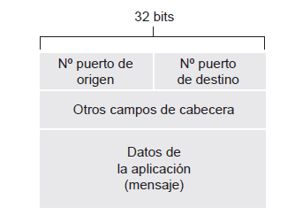
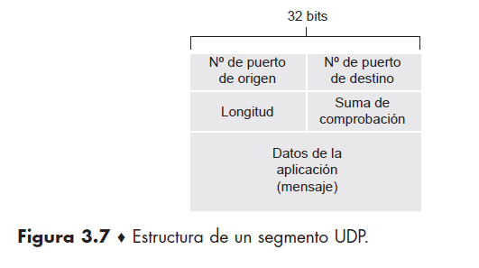
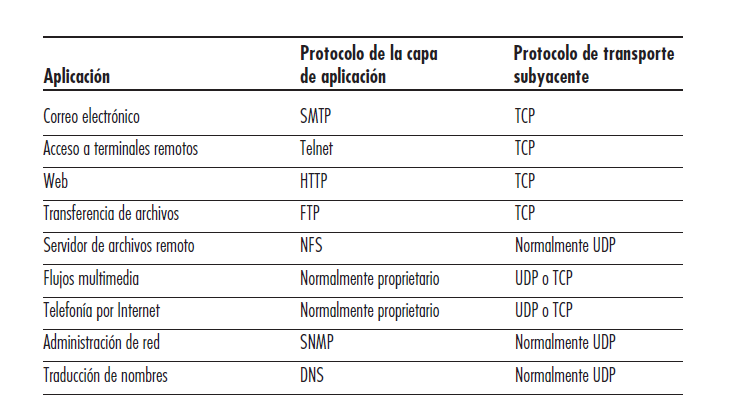
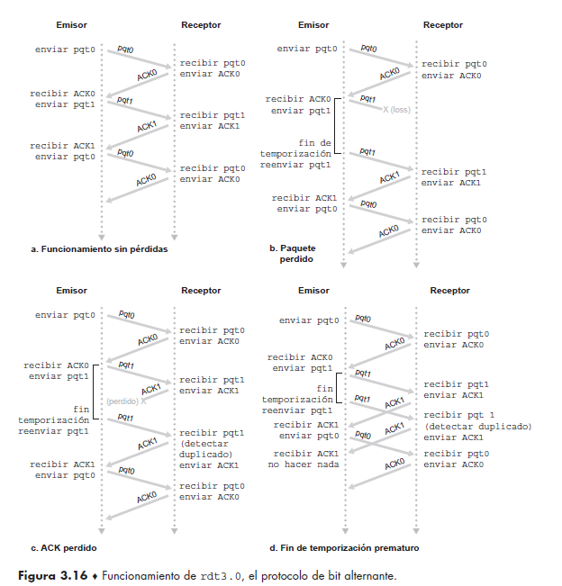

# Práctica 5 - Capa de transporte - Parte I

## 1.Función de la capa de transporte
Un protocolo de la capa de transporte proporciona una comunicación lógica entre procesos de aplicación que se ejecutan en hosts diferentes.
Los procesos de aplicación utilizan la comunicación lógica proporcionada por la capa de transporte para enviarse mensajes entre sí, sin preocuparse por los detalles de la infraestructura física utilizada para transportar estos mensajes.

## 2. Describa la estructura del segmento TCP y UDP

la operación de multiplexación que se lleva a cabo en la capa de transporte requiere (1) que los sockets tengan identificadores únicos y (2) que cada segmento tenga campos especiales que indiquen el socket al que tiene que entregarse el segmento. Estos campos especiales, son el campo número de puerto de origen y el campo número de puerto de destino. (Los segmentos UDP y TCP contienen además otros campos) Cada número de puerto es un número de 16 bits comprendido en el rango de 0 a 65535. Los números de puerto pertenecientes al rango de 0 a 1023 se conocen como números de puertos bien conocidos y son restringidos, lo que significa que están reservados para ser empleados por los protocolos de aplicación bien conocidos, como por ejemplo HTTP (que utiliza el número de puerto 80) y FTP (que utiliza el número de puerto 21).

### Sobre UDP 
UDP toma los mensajes procedentes del proceso de la aplicación, asocia los campos correspondientes a los números de puerto de origen y de destino para proporcionar el servicio de multiplexación/ demultiplexación, añade dos campos pequeños más y pasa el segmento resultante a la capa de red. La capa de red encapsula el segmento de la capa de transporte en un datagrama IP y luego hace el mejor esfuerzo por entregar el segmento al host receptor. Si el segmento llega al host receptor, UDP utiliza el número de puerto de destino para entregar los datos del segmento al proceso apropiado de la capa de aplicación. Observe que con UDP no tiene lugar una fase de establecimiento de la conexión entre las entidades de la capa de transporte emisora y receptora previa al envío del segmento. Por esto, se dice que UDP es un protocolo sin conexión.
Beneficio: 
- Mejor control en el nivel de aplicación sobre qué datos se envían y cuándo. 
- Sin establecimiento de la conexión: a diferencia de TCP lleva a cabo un proceso de establecimiento de la conexión en tres fases antes de iniciar la transferencia de datos. 
- Sin información del estado de la conexión: un servidor puede soportar más clientes activos cuando la aplicación se ejecuta sobre UDP. 
- Poca sobrecarga debida a la cabecera de los paquetes: solo requiere 8 bytes (TCP requiere 20 by). 

La cabecera UDP solo tiene cuatro campos, y cada uno de ellos tiene una longitud de dos bytes. El campo de **longitud** especifica el número de bytes del segmento UDP (la cabecera más los datos). Los **números de puerto** permiten al host de destino pasar los datos de la aplicación al proceso apropiado que está ejecutándose en el sistema terminal de destino (es decir, realizar la función de demultiplexación). Es necesario un valor de longitud explícito ya que el tamaño del campo de datos puede variar de un segmento UDP al siguiente. El host receptor utiliza la suma de comprobación para detectar si se han introducido errores en el segmento.

---

## A tomar en cuenta

- TCP posee flags y estados. La cabecera es mucho más grande que UDP. 
- El checksum de UDP es opcional. 
- En todos los momentos en los que se hace push no se actualiza el valor del segmento sino cuando se recibe el ACK el segmento se actualiza con el valor que proporcionó el length del push. 
-  _Aplicaciones de internet populares y sus protocolos de transporte subyacentes._

