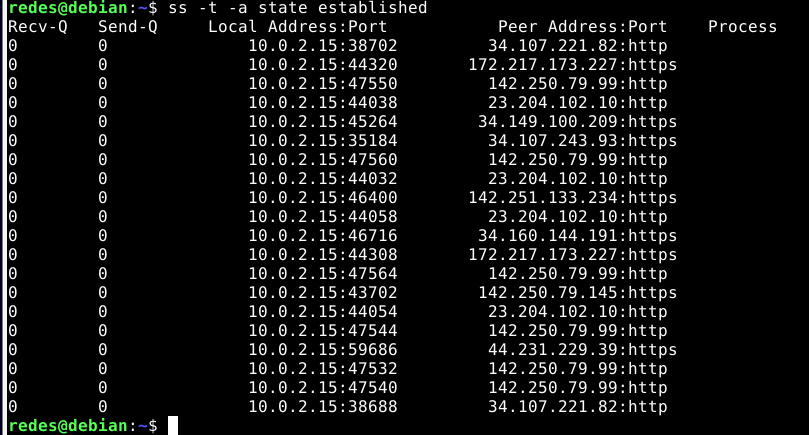
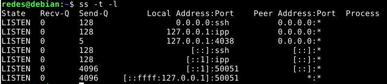
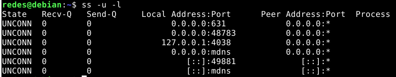
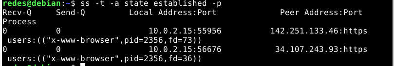

# Práctica 5 - Capa de transporte - Parte I

## 1.Función de la capa de transporte
Un protocolo de la capa de transporte proporciona una comunicación lógica entre procesos de aplicación que se ejecutan en hosts diferentes.
Los procesos de aplicación utilizan la comunicación lógica proporcionada por la capa de transporte para enviarse mensajes entre sí, sin preocuparse por los detalles de la infraestructura física utilizada para transportar estos mensajes.

## 2. Describa la estructura del segmento TCP y UDP

la operación de multiplexación que se lleva a cabo en la capa de transporte requiere (1) que los sockets tengan identificadores únicos y (2) que cada segmento tenga campos especiales que indiquen el socket al que tiene que entregarse el segmento. Estos campos especiales, son el campo número de puerto de origen y el campo número de puerto de destino. (Los segmentos UDP y TCP contienen además otros campos) Cada número de puerto es un número de 16 bits comprendido en el rango de 0 a 65535. Los números de puerto pertenecientes al rango de 0 a 1023 se conocen como números de puertos bien conocidos y son restringidos, lo que significa que están reservados para ser empleados por los protocolos de aplicación bien conocidos, como por ejemplo HTTP (que utiliza el número de puerto 80) y FTP (que utiliza el número de puerto 21).

### Sobre UDP 
UDP toma los mensajes procedentes del proceso de la aplicación, asocia los campos correspondientes a los números de puerto de origen y de destino para proporcionar el servicio de multiplexación/ demultiplexación, añade dos campos pequeños más y pasa el segmento resultante a la capa de red. La capa de red encapsula el segmento de la capa de transporte en un datagrama IP y luego hace el mejor esfuerzo por entregar el segmento al host receptor. Si el segmento llega al host receptor, UDP utiliza el número de puerto de destino para entregar los datos del segmento al proceso apropiado de la capa de aplicación. Observe que con UDP no tiene lugar una fase de establecimiento de la conexión entre las entidades de la capa de transporte emisora y receptora previa al envío del segmento. Por esto, se dice que UDP es un protocolo sin conexión.
Beneficio: 
- Mejor control en el nivel de aplicación sobre qué datos se envían y cuándo. 
- Sin establecimiento de la conexión: a diferencia de TCP lleva a cabo un proceso de establecimiento de la conexión en tres fases antes de iniciar la transferencia de datos. 
- Sin información del estado de la conexión: un servidor puede soportar más clientes activos cuando la aplicación se ejecuta sobre UDP. 
- Poca sobrecarga debida a la cabecera de los paquetes: solo requiere 8 bytes (TCP requiere 20 by). 


La cabecera UDP solo tiene cuatro campos, y cada uno de ellos tiene una longitud de dos bytes. El campo de **longitud** especifica el número de bytes del segmento UDP (la cabecera más los datos). Los **números de puerto** permiten al host de destino pasar los datos de la aplicación al proceso apropiado que está ejecutándose en el sistema terminal de destino (es decir, realizar la función de demultiplexación). Es necesario un valor de longitud explícito ya que el tamaño del campo de datos puede variar de un segmento UDP al siguiente. El host receptor utiliza la suma de comprobación para detectar si se han introducido errores en el segmento.


### 6. Describa el saludo de tres vías de TCP. ¿UDP tiene esta característica?
El saludo de tres vías (three-way handshake) es el proceso utilizado por TCP (Transmission Control Protocol) para establecer una conexión fiable entre dos dispositivos antes de transmitir datos. Este mecanismo garantiza que ambas partes estén listas para la comunicación y que no haya errores en el inicio de la transmisión. Los pasos son:

1. **SYN (Synchronize):** El cliente envía un segmento TCP con el bit SYN activado al servidor, indicando que desea iniciar una conexión. Este paquete incluye un número de secuencia inicial (ISN) generado por el cliente.

2. **SYN-ACK (Synchronize-Acknowledge):** El servidor recibe el segmento SYN, responde con un paquete que tiene activados los bits SYN y ACK. El servidor también genera su propio ISN y envía el reconocimiento (ACK) del ISN del cliente.

3. **ACK (Acknowledge):** El cliente responde al paquete SYN-ACK del servidor con un paquete que tiene activado solo el bit ACK, confirmando la recepción del ISN del servidor. En este punto, la conexión se establece y los datos pueden ser transmitidos.

El saludo de tres vías asegura una conexión confiable y sincroniza los números de secuencia entre el cliente y el servidor.

UDP (User Datagram Protocol) no tiene esta característica, ya que es un protocolo de comunicación sin conexión. UDP envía los datos sin establecer una conexión previa ni garantizar la entrega, lo que lo hace más rápido pero menos fiable que TCP.

### 7. ¿Qué es el ISN (Initial Sequence Number)? Relación con el saludo de tres vías.
El ISN (Initial Sequence Number) es el número de secuencia inicial generado por cada host (cliente y servidor) durante el establecimiento de la conexión TCP. Permite que los dispositivos sincronicen y rastreen los segmentos de datos que se intercambian en la comunicación.
Durante el saludo de tres vías:
- El cliente envía un paquete con su ISN en el segmento SYN al servidor.
- El servidor responde con su propio ISN en el segmento SYN-ACK, junto con un reconocimiento del ISN del cliente.
- El cliente envía un paquete ACK confirmando que recibió el ISN del servidor.
- El ISN evita que paquetes viejos (de conexiones anteriores) sean confundidos con paquetes válidos en una nueva conexión. Además, los ISN se generan de manera pseudoaleatoria para mejorar la seguridad del protocolo y evitar ataques de predicción de números de secuencia.


### 8. ¿Qué es el MSS? ¿Cuándo y cómo se negocia?
El MSS (Maximum Segment Size) es el tamaño máximo de un segmento de datos que un dispositivo está dispuesto a recibir en una conexión TCP. En otras palabras, es el tamaño máximo de datos que se pueden enviar en un solo segmento TCP sin incluir los encabezados de TCP e IP.

El MSS ayuda a evitar que los paquetes sean fragmentados al atravesar la red, lo que puede causar una sobrecarga adicional y problemas de rendimiento.

El MSS se negocia durante el saludo de tres vías (three-way handshake) al establecer una conexión TCP. El cliente y el servidor intercambian información sobre el MSS en los segmentos SYN que se envían en los primeros dos pasos del proceso de handshake.

- Cliente: Cuando el cliente envía el primer paquete SYN para solicitar una conexión TCP, incluye su MSS en una opción del encabezado TCP. Esto informa al servidor del tamaño máximo de segmento que el cliente puede recibir.

- Servidor: En respuesta, cuando el servidor envía el paquete SYN-ACK, también incluye su propio MSS en el encabezado, informando al cliente sobre el tamaño máximo de segmento que está dispuesto a recibir.

Ejemplo:
- El cliente envía un paquete SYN al servidor, indicando que su MSS es de 1460 bytes (lo que suele ser común para conexiones sobre Ethernet con una MTU de 1500 bytes).
- El servidor responde con un SYN-ACK, informando que su MSS es de 1460 bytes o quizás un valor diferente si tiene una limitación distinta.
- A partir de ese momento, ambos dispositivos ajustan el tamaño de los segmentos de datos que envían para que no excedan el MSS negociado por la contraparte.


### 9. Utilice el comando ss (reemplazo de netstat) para obtener la siguiente información de su PC: 
- a. Para listar las comunicaciones TCP establecidas. 
```c
ss -t -a 
``` 


- b. Para listar las comunicaciones UDP establecidas. 
```c
ss -u -a
```


- c. Obtener sólo los servicios TCP que están esperando comunicaciones
```c
ss -t -l 
```

- d. Obtener sólo los servicios UDP que están esperando comunicaciones. 
```c
ss -u -l
```


- e. Repetir los anteriores para visualizar el proceso del sistema asociado a la conexión.
```c
ss -t -a state established -p
```


- f. Obtenga la misma información planteada en los items anteriores usando el comando netstat.

Listar conexiones TCP establecidas: `netstat -tn`
Listar conexiones UDP: `netstat -un`
Servicios TCP esperando conexiones: `netstat -tl`
Servicios UDP esperando conexiones: `netstat -ul`

Conexiones TCP con procesos: `netstat -tnp`
Conexiones UDP con procesos: `netstat -unp`
Servicios TCP en espera con procesos: `netstat -tlp`
Servicios UDP en espera con procesos: `netstat -ulp`

- **R (Reset)**: Este flag indica que la conexión solicitada no es válida o no puede ser establecida. El host destino envía un paquete con el flag RST (Reset) para informar que la conexión no será aceptada. Esto puede suceder si no hay un servicio escuchando en el puerto especificado (en este caso, el puerto 80) o si la conexión no puede ser completada por alguna otra razón.

- **A (Acknowledgment)**: El flag ACK indica que el paquete es una respuesta a un paquete previo y está reconociendo su recepción. Es decir, el host destino está indicando que ha recibido el SYN enviado previamente por hping3, pero como no quiere establecer la conexión, envía un paquete de "reset" (RST) junto con el reconocimiento (ACK).

Por lo tanto, el RA en esta salida indica que el host está respondiendo a la solicitud de conexión TCP con un paquete que incluye tanto el flag RST (Reset) como el flag ACK (Acknowledgment), lo que significa que el servidor ha recibido la solicitud pero no desea continuar con la conexión.

---

## A tomar en cuenta

- TCP posee flags y estados. La cabecera es mucho más grande que UDP. 
- El checksum de UDP es opcional. 
- En todos los momentos en los que se hace push no se actualiza el valor del segmento sino cuando se recibe el ACK el segmento se actualiza con el valor que proporcionó el length del push. 
-  _Aplicaciones de internet populares y sus protocolos de transporte subyacentes._

