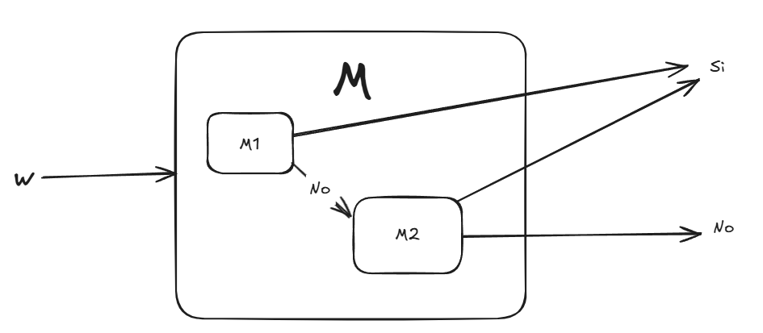
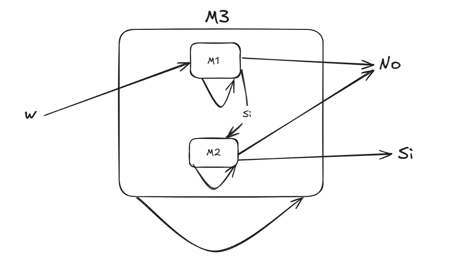

## Ejercicio 1

1. 
E = {a, b, c}
L = {a^n b^n c^n|n>= 0}

=>  Ʃ*⋂ L = L  , pues L se encuentra contenido en  Ʃ* por ser L un subconjunto de Ʃ*
=>  Ʃ* ⋃ L = Ʃ* , pues todo elemento de L se encuentra en Ʃ*. Idem anterior. 
=> L^c = Ʃ*- L  , como L se encuentra contenido en Ʃ* entonces todo los elementos que pertenecen a L pertenecen también a Ʃ* su intersección serán todos los elementos que pertenecen a Ʃ* y no a L.

2. Problema de satisfactibilidad de las fórmulas booleanas 
- Visión de MT calculadora -> ante la entrada de fórmula booleana la salida será una asignación de valores de verdad, si no existe la máquina rechazará. 
- Visión de MT reconocedora -> ante la entrada de fórmula booleana la salida será _sí_ si existe una asignación de valores que la expresión se evalúe como verdadera, por el contrario rechazará. 
- Visión de MT generadora -> genera todas las fórmulas booleanas satisfactibles. 

3. Tesis de Church-Turing: Todo dispositivo de computación físicamente realizable puede ser simulado por una MT.

4. 
- MTs equivalentes -> aceptan el mismo lenguaje, o sea, ante la misma cadena de entrada ambas máquinas tendrán el mismo comportamiento. M1 y M2 pueden tener mecanismos internos y formas diferentes en procesar la entrada pero se comportan igual.
- Modelos de MT equivalentes -> si dada una MT de un modelo existe una MT equivalente del otro. Ejemplo: MT con una sola cinta y otro modelo con varias cintas ya que cualquier lenguaje que pueda ser reconocido por la máquina de dos cintas entonces es también reconocible por el modelo de una cinta. 

5. 
- Lenguajes R (recursivos): que ante la entrada la máquina siempre se detendrá (rechace o acepte)
- Lenguajes RE (recursivos enumerables): son los lenguajes que la máquina en los casos positivas acepta la entrada o la máquina no para. 
- Lenguaje no recursivamente enumerables: no existe una máquina de Turing que lo pueda reconocer, ni siquiera de forma parcial (como el caso de que acepte).

6. Probar $RE \subseteq R \subseteq \mathcal{L}$

$RE \subseteq R$ -> En $R$ se encuentran los lenguajes que tienen una MT qe los acepte, en el caso de $RE$, por definición, se consideran los lenguajes que se detienen en caso de aceptar o en caso de rechazar se detienen en $\quad q_r$. o loopean. Por definición entonces se prueba que todo lenguaje recursivo es también un lenguaje recursivamente enumerable. 

$RE \subseteq \mathcal{L}$ -> Dado que $\mathcal{L}$ es el conjunto de todos los lenguajes y $RE$ está compuesto por lenguajes entonces pertenecen a $\mathcal{L}$. 

7. Explicar por qué (a) el lenguaje Ʃ* de todas las cadenas, (b) el lenguaje vacío $\text{\o}$, (c) cualquier lenguaje finito, son recursivos. 

Se puede definir una MT M que acepte $w \in Ʃ*$ tal que al leer el primer símbolo del alfabeto la máquina se **detenga** y lo acepte, por lo tanto Ʃ* pertenece al lenguaje y es recursivo.

En el caso del lenguaje vacío éste significa que no hay $w$ que una MT M acepte, entonces siempre se **detendrá** ante cualquier cadena de entrada, por lo tanto, $\text{\o}$ es recursivo. 

Un lenguaje finito implica que se tiene un número finito de cadenas entonces es posible definir una MT M que siempre se detenga, es decir ante una entrada $w$ que compare con una lista finita de palabras del lenguaje (pues el lenguaje es finito), si coincide acepta, sino rechaza, entonces el lenguaje finito es recursivo. 

8. Explicar por qué no es correcta la siguiente prueba de que si $L \in RE$ también $L^c \in RE$: dada una MT M que acepta L, entonces la MT M' igual que M pero con los estados finales permutados, acepta $L^c$ 

No es correcto porque si un $ w \in L \in RE$ significa que existe una máquina que se detiene o loopea entonces $R \subseteq RE$  (demostrado más antes) por lo tanto $L^c$ no pertenece a a $RE$ ni a $R$. Entonces la cadena $w \in L^c$ no tendrá máquina que le acepte. 

## Ejercicio 2 
Explicar como una MT que en un paso no puede simultáneamente modificar un símbolo y moverse, puede simular (ejecutar) una MT que sí lo puede hacer. 
Dada una MT M que si puede modificar un paso y moverse entonces podemos definir una MT M' con el doble de pasos. Para cada estado de M que requiera escribir y moverse a una dirección se descompondrá en dos: un primer estado que modifique el símbolo y el segundo estado que implique mover el cabezal y pasar al estado que le correspondía. 
Por ejemplo: 
se tiene la transición en MT M:  $(q, a) -> (q', A, R)$  
Entonces en M' se tendrá $(q, a) -> (q*, A, S); (q*, A) -> (q', A, R)$

## Ejercicio 3
Describir la idea general de una MT con varias cintas que acepte, de la manera más eficiente posible (menor cantidad de pasos), el lenguaje $L = $ {$a^n b^n c^n | n \geq 0$}

Idea general: 
En la segunda cinta se copian los caracteres "a" de la primera cinta (en el caso de  que en la primera cinta se encuentre un caracter diferente a "a" o "b" la máquina rechaza) hasta encontrar un caracter "b". 
Luego, se recorren ambas cintas: la segunda cinta hacia la izquierda y la primera hacia la derecha. Se va comparando el contenido de las dos cintas, de cada "a" con las "b".  
En el caso de que la cantidad de "a" sea igual a la cantidad de "b" entonces se comparará con los caracteres "c" de la primera cinta (caso contrario rechaza). 
De la misma forma, si la cantidad de "a" es igual a la cantidad de "c" entonces la máquina acepta. 

## Ejercicio 4 
Probar: 
1. La clase R es cerrada con respecto a la operación de unión. 

Sean $L_1, L_2 \in  R$ y $M_1, M_2$ son MT que deciden los lenguajes correspondientes entonces existe una MT $M_3$ dada una entrada $w \in L_1 \cup L_2$ se detiene siempre. 

Entonces, $M_1$ ejecuta, en caso de aceptar entonces $M_3$ acepta; en caso de rechazar se prueba $w$ en $M_2$. En caso de aceptar entonces $M_3$ acepta, caso contrario $M_3$ rechaza. Se garantiza que $M_3$ siempre se detiene pues tanto $M_1$ como $M_2$ se detienen entonces $M_3$ reconoce $L_1 \cup L_2$ 

2. La clase $RE$ es cerrada con respecto a la operación de intersección. 

Sean $L_1, L_2 \in  RE$ y $M_1, M_2$ son MT que reconocen los lenguajes correspondientes entonces existe una MT $M_3$ dada una entrada $w \in L_1 \cap L_2$ lo reconoce. 

Entonces $M_1$ ejecuta, en caso de aceptar entonces se ejecuta $M_2$. En caso de rechazar $M_3$ rechaza. 
$M_2$ ejecuta y en caso de aceptar entonces $M_3$ acepta, caso contrario rechaza. 
Si en algún momento $M_1$ o $M_2$ no se detienen entonces $M_3$ no se detiene. 
En síntesis, si $M_1$ o $M_2$ rechazan la entrada entonces $M_3$ rechaza, si es rechazada por ambas máquinas entonces $M_3$ rechaza, si $M_1$ o $M_2$ se quedan loopeando entonces $M_3$ se va a quedar loopeando.  

## Ejercicio 5
Sean $L_1$ y $L_2$ dos lenguajes recursivamente numerables de números naturales codificados en unario. Probar que también es recursivamente numerable el lenguaje $L = \{ x | x es un número natural codificado en unario y existen y, z / x+z = x, y \in L_1, z \in L_2 \}$

Dado que una cadena $ w = x_1\times x_2 \in L$ con $x_1 \in L_1$ y $x_2 \in L_2$ e

