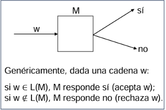
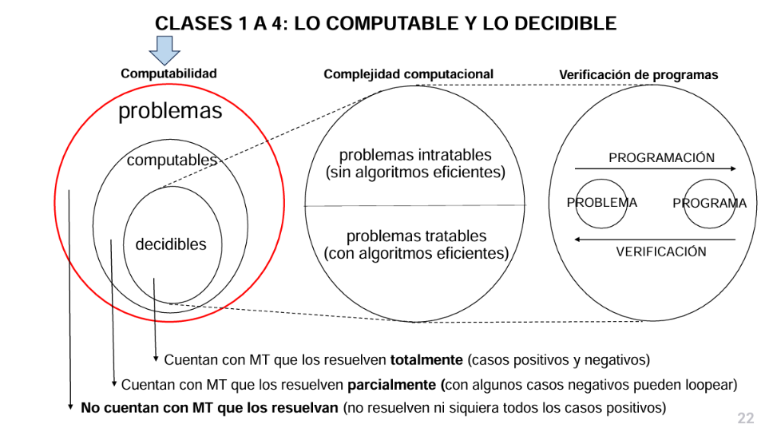

# Clase 1 - TCVP 

### Resumen

*   **Máquina de Turing (MT):** Es un modelo general de computación. Una MT puede modificar un símbolo, cambiar su estado y moverse a la izquierda o a la derecha.
*   **Tesis de Church-Turing:** Todo dispositivo de computación físicamente realizable puede ser simulado por una MT.
*   **Computabilidad:** Estudia qué problemas pueden ser resueltos por algoritmos. Algunos problemas son computables pero no decidibles, lo que significa que una MT puede responder "sí" si la entrada pertenece al lenguaje, pero puede no responder o "loopear" si no pertenece.
*   **Decidibilidad:**  Se refiere a problemas para los cuales existe una MT que siempre se detiene, respondiendo "sí" o "no".
*   **Lenguaje Formal:** Un lenguaje con alfabeto Σ es un conjunto de cadenas finitas de símbolos de Σ. Una MT acepta un lenguaje si reconoce las cadenas que pertenecen a él.
*   **Conjuntos y Funciones:** Se revisan conceptos básicos de conjuntos (subconjuntos, intersección, unión, diferencia) y funciones (dominio, codominio).
*   **Grafos:** Un grafo es un par (V, E) donde V es un conjunto de vértices y E es un conjunto de arcos.
*   **Fórmulas booleanas:** Combinación de variables booleanas con operadores lógicos (AND, OR, NOT). Una fórmula es satisfactible si existe una asignación de valores que la hace verdadera.
*   **Modelos equivalentes de MT:**  Existen modelos de MT equivalentes al modelo estándar (una cinta), como MT con varias cintas. La MT con múltiples cintas no tiene más poder de computación que una MT con una sola cinta.
*   **Máquina de Turing No Determinista (MTN):** Para un mismo par (estado, símbolo), la máquina puede responder de más de una manera. Una MTN acepta una cadena si al menos una computación la acepta.

---

## Máquina de Turing

## Computabilidad 

- Problemas de **búsqueda**: en estos problemas, una MT debe encontrar una solución. 
    -> Hay una solución -> MT la devuelve,
    -> No hay solución -> MT responde "No".
    _Ejemplo: Encontrar un camino entre dos vértices en un grafo no dirigido_

- Problemas de **decisión**: en estos problemas, la MT debe determinar si una determinada entrada cumple con una propiedad específica y responder "Si" o "No". 
    - La MT solo responde SI o NO aceptando rechazando la entrada. 
    _Ejemplo:Determinar si un grafo tiene un camino del vértice inicial al final. Determinar si una fórmula booleana es satisfacible._

> Serán consideradas los problemas de decisión: las máquinas de Turing sólo van a responder sí o no (aceptar - rechazar)

Entonces, `L(M)` indica el lenguaje que acepta la Máquina de Turing 
_Ejemplo: `L(M) = {φ1, φ2, φ3, …}` donde φ es una fórmula booleana satisfactible_

> Se utilizarán las palalbras problema y lenguaje de forma indistinta. 

- **Problemas computables**:
    - **decidibles:** la MT siempre se detiene.  Estos problemas se resuelven totalmente, tanto en casos positivos como negativos. 
    - **no decidibles:** la MT los resuelve parcialmente. No existe una MT que siempre se detenga para estos problemas. 
        - Si la entrada pertenece al lenguaje responde "Sí". 
        - Si la entrada no pertenece al lenguaje, la MT puede responder "no" o "loopear".
    _Ejemplo: el problema de decidir si un prorgama P para (Halting problem)_

- **Problemas no computables:** no tienen MT que los resuelvan (ni siquiera que respondan sí en todos los casos positivos). _Ejemplo: decidir la equivalencia de dos programas P1 y P2_

---

# Anexo
## Repaso conceptos básicos 

- **Alfabeto** -> conjunto finito de símbolos. `Ʃ = {a, b, c}` es un alfabeto de tres símbolos.
- **Lenguaje** -> lenguaje con alfabeto  Ʃ es un conjunto de cadenas finitas de símbolos de  Ʃ. `L = {aaa, b, abababa, ccb}`
- **Operaciones típicas** -> las mismas que entre conjuntos (resta, unión, disjunción, complemento) 
- **Grafo** ->par (V, E) tal qie V es un conjunto de vértices y E es un conjunto de arcos. 
- Una **fórmula booleana** es una fórmula lógica que se obtiene combinando variables booleanas, de valor de verdad verdadero (V) o falso (F), con los operadores lógicos and, or y not (¬).
- **Fórmula booleana _satisfactible_** -> existe al menos una asignación de valores de verdad que la evalúa verdadera. 
