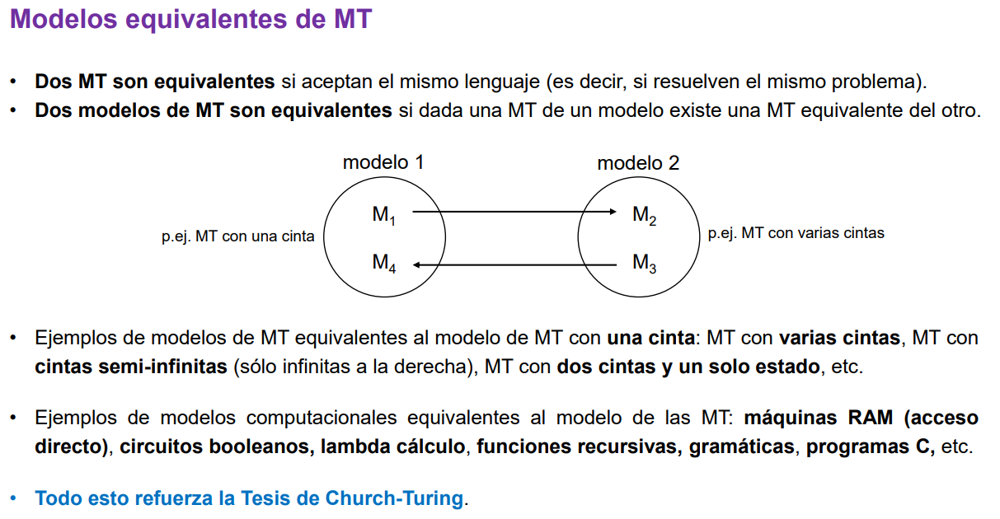

# Clase 1 - TCVP 

### Resumen

*   **Máquina de Turing (MT):** Es un modelo general de computación. Una MT puede modificar un símbolo, cambiar su estado y moverse a la izquierda o a la derecha.
*   **Tesis de Church-Turing:** Todo dispositivo de computación físicamente realizable puede ser simulado por una MT.
*   **Computabilidad:** Estudia qué problemas pueden ser resueltos por algoritmos. Algunos problemas son computables pero no decidibles, lo que significa que una MT puede responder "sí" si la entrada pertenece al lenguaje, pero puede no responder o "loopear" si no pertenece.
*   **Decidibilidad:**  Se refiere a problemas para los cuales existe una MT que siempre se detiene, respondiendo "sí" o "no".
*   **Lenguaje Formal:** Un lenguaje con alfabeto Σ es un conjunto de cadenas finitas de símbolos de Σ. Una MT acepta un lenguaje si reconoce las cadenas que pertenecen a él.
*   **Conjuntos y Funciones:** Se revisan conceptos básicos de conjuntos (subconjuntos, intersección, unión, diferencia) y funciones (dominio, codominio).
*   **Grafos:** Un grafo es un par (V, E) donde V es un conjunto de vértices y E es un conjunto de arcos.
*   **Fórmulas booleanas:** Combinación de variables booleanas con operadores lógicos (AND, OR, NOT). Una fórmula es satisfactible si existe una asignación de valores que la hace verdadera.
*   **Modelos equivalentes de MT:**  Existen modelos de MT equivalentes al modelo estándar (una cinta), como MT con varias cintas. La MT con múltiples cintas no tiene más poder de computación que una MT con una sola cinta.
*   **Máquina de Turing No Determinista (MTN):** Para un mismo par (estado, símbolo), la máquina puede responder de más de una manera. Una MTN acepta una cadena si al menos una computación la acepta.

---

## Máquina de Turing

El funcionamiento de una máquina de Turing se basa en los siguientes componentes:
- Una **unidad de control** que posee un conjunto finito de estados. Entre estos estados se incluyen un estado inicial (q0), un estado de aceptación (qA) y un estado de rechazo (qR).
- Una **función de transición (δ)** que especifica el algoritmo que la máquina ejecuta. Esta función determina el siguiente estado de la unidad de control, el símbolo que se escribe en la cinta y el movimiento del cabezal, basándose en el estado actual y el símbolo leído.
- Una **cinta infinita en ambos extremos**, dividida en celdas, donde se pueden escribir símbolos.
- Un **cabezal** que puede leer y escribir símbolos en la cinta y moverse una celda a la izquierda (L), a la derecha (R) o permanecer en el mismo lugar (S).

En cada momento de la ejecución, la máquina se encuentra en una configuración determinada por su estado actual, el contenido de la cinta y la posición del cabezal.
En cada paso, la máquina:
1. Lee el símbolo al que apunta el cabezal en la cinta.
2. Consulta su estado actual y el símbolo leído en la función de transición (δ).
3. Basándose en la definición de δ para esa combinación (estado actual, símbolo leído), la máquina realiza las siguientes acciones:
    - Cambia a un nuevo estado.
    - Escribe un nuevo símbolo (o el mismo) en la celda actual de la cinta.
    - Mueve el cabezal a la izquierda, a la derecha o lo deja en la misma posición.
La ejecución continúa hasta que la máquina alcanza un estado de aceptación (qA) o un estado de rechazo (qR), en cuyo caso la máquina se detiene.

> [!NOTE]
> Es importante destacar la Tesis de Church-Turing, que postula que cualquier dispositivo computacional físicamente realizable puede ser simulado por una máquina de Turing. Esto subraya la universalidad del modelo de la máquina de Turing como un concepto fundamental en la computación.

### Perspectivas
- Como calculadoras: a partir de una entrada producen una salida, resolviendo problemas de búsqueda. 
- Como reconocedoras: aceptan o rechazan entradas, resolviendo problemas de decisión ->  la máquina reconoce un lenguaje formado por el conjunto de todas las cadenas que acepta (las instancias que tienen solución). 
- Como generadoras: se escriben todas las cadenas acorrespondientes a las instancias positivas de un problema en una cinta de salida. 

### MT de varias cintas
Posee variascintas, cada una con su propio cabezal de escritura/lectura independiente. La unidad de control sigue siendo única. 

#### Funcionamiento
El funcionamiento de una MT con varias cintas es el siguiente:
1. En un solo paso, la máquina lee el estado corriente de la unidad de control y el símbolo corriente al que apunta cada uno de los K cabezales en sus respectivas cintas.
2. Basándose en esta información, la función de transición (δ) determina:
    - El nuevo estado de la unidad de control.
    - El símbolo que se escribirá en la celda actual de cada una de las K cintas.
    - El movimiento independiente (izquierda, derecha o ninguno) de cada uno de los K cabezales.
Una configuración de una MT con varias cintas está definida por el estado actual, el contenido de todas las cintas y la posición de cada uno de los cabezales.

> Teorema: cualquier MT con K > 1 cintas puede ser simulada por una MT con una sola cinta: Las pistas impares almacenan el contenido de las cintas originales, y las pistas pares almacenan la posición del cabezal correspondiente mediante una marca. Sin embargo, esta simulación introduce un retardo en el tiempo de ejecución. El texto indica que simular h pasos de una MT con K cintas puede requerir un tiempo del orden de O(h²) en una MT con una sola cinta.

### Modelos equivalentes de MT 
**Equivalencia de dos MTs:** dos máquinas se consideran equivalentes si aceptan el mismo lenguaje. Se centra en el lenguaje específico que cada máquina reconoce o decide, sin importar los detalles internos de su funcionamiento, como el número de estados o la función de transición específica.  _Por ejemplo, dos MTs con diferentes conjuntos de estados y funciones de transición podrían ser equivalentes si ambas reconocen el lenguaje_
**Equivalencia de dos modelos de MTs:** indica que dada una MT de un modelo, existe una MT equivalente del otro modelo. Cualquier problema que pueda ser resuelto por una MT en un modelo también puede ser resuelto por una MT en el otro modelo y viceversa. La prueba de equivalencia entre dos modelos generalmente implica demostrar que una máquina del primer modelo puede simular cualquier máquina del segundo modelo, y viceversa.

## Computabilidad 

- Problemas de **búsqueda**: en estos problemas, una MT debe encontrar una solución. 
    -> Hay una solución -> MT la devuelve,
    -> No hay solución -> MT responde "No".
    _Ejemplo: Encontrar un camino entre dos vértices en un grafo no dirigido_

- Problemas de **decisión**: en estos problemas, la MT debe determinar si una determinada entrada cumple con una propiedad específica y responder "Si" o "No". 
    - La MT solo responde SI o NO aceptando rechazando la entrada. 
    _Ejemplo:Determinar si un grafo tiene un camino del vértice inicial al final. Determinar si una fórmula booleana es satisfacible._

> Serán consideradas los problemas de decisión: las máquinas de Turing sólo van a responder sí o no (aceptar - rechazar)

Entonces, `L(M)` indica el lenguaje que acepta la Máquina de Turing 
_Ejemplo: `L(M) = {φ1, φ2, φ3, …}` donde φ es una fórmula booleana satisfactible_

> Se utilizarán las palabras problema y lenguaje de forma indistinta (temporalmente). 

- **Problemas computables**:
    - **decidibles:** la MT siempre se detiene.  Estos problemas se resuelven totalmente, tanto en casos positivos como negativos. 
    - **no decidibles:** la MT los resuelve parcialmente. No existe una MT que siempre se detenga para estos problemas. 
        - Si la entrada pertenece al lenguaje responde "Sí". 
        - Si la entrada no pertenece al lenguaje, la MT puede responder "no" o "loopear".
    _Ejemplo: el problema de decidir si un progama P para (Halting problem)_

- **Problemas no computables:** no tienen MT que los resuelvan (ni siquiera que respondan sí en todos los casos positivos). _Ejemplo: decidir la equivalencia de dos programas P1 y P2_

---

# Anexo
## Repaso conceptos básicos 

- **Alfabeto** -> conjunto finito de símbolos. `Ʃ = {a, b, c}` es un alfabeto de tres símbolos.
- **Lenguaje** -> lenguaje con alfabeto  Ʃ es un conjunto de cadenas finitas de símbolos de  Ʃ. `L = {aaa, b, abababa, ccb}`
- **Operaciones típicas** -> las mismas que entre conjuntos (resta, unión, disjunción, complemento) 
- **Grafo** ->par (V, E) tal qie V es un conjunto de vértices y E es un conjunto de arcos. 
- Una **fórmula booleana** es una fórmula lógica que se obtiene combinando variables booleanas, de valor de verdad verdadero (V) o falso (F), con los operadores lógicos and, or y not (¬).
- **Fórmula booleana _satisfactible_** -> existe al menos una asignación de valores de verdad que la evalúa verdadera. 
