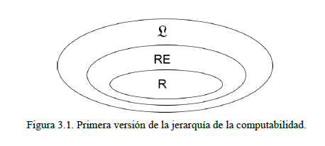
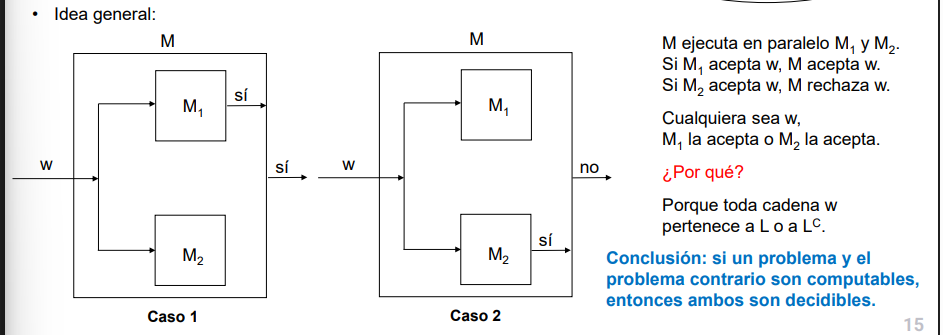

# Clase 2 - TCVP

### Resumen
Se introduce el concepto de **jerarquía de la computabilidad**: un esquema para clasificar problemas según su grado de dificultad desde la perspectiva de la computabilidad. 

## Clasificación de lenguajes 
Sea _L_ el conjunto de todos los lenguajes, representante del conjunto de todos los problemas de decisión. Y sea Ʃ el alfabeto de los símbolos que integran las cadenas de los lenguajes de _L_ (toda cadena de un lenguaje de _L_ pertenece al conjunto Ʃ*). Para definir la jerarquía de la computabilidad, comenzamos distinguiendo en _L_ los siguientes dos conjuntos de lenguajes:
- Lenguajes **recursivamente enumerables (RE)**: existe una MT que los acepta, Si una cadena pertenece al lenguaje, la MT eventualmente se detendrá y aceptará, si la cadena no pertenece al lenguaje, la MT podría tenerse y rechazar o nunca detenerse (problemas computables decidibles y no decidibles). Para los positivos siempre acepta, para los negativos puede llegar a loopear.
    - Propiedad: sus cadenas pueden enumerarse, se pueden imprimir. 
- Lenguajes **recursivos (R)**: existe una MT que lo reconoce y **se detiene siempre**, ya sea qA o qR (problemas computables decidibles). 

> Un problema no computable -> L no es RE 

Se establece entonces que `R ⊆ RE ⊆ L`. 

> Para toda cadena perteneciente a L entonces pertenece a R, la MT la acepta y siempre para. 

> Un Lenguaje pertenece a RE  sii existe una MT que lo acepta o no para. 

> Un lenguaje de R es un caso particular de RE.

## Propiedades de los lenguajes recursivamente enumerables y los lenguajes recursivos

### Lenguajes Recursivos 
#### Propiedad 1: Si L ∈ R, entonces L^c ∈ R.
Es decir, si existe una MT M1 que decide L, también existe una MT M2 que decide L^c 

> Si un problema es decidible, entonces, también lo es el problema contrario.

> Las unicas 5-uplas que se modifican son los estados finales, los de transición permanecen igual. 

#### Propiedad 2. Si L1 ∈ R y L2 ∈ R, entonces L1 ⋂ L2 ∈ R y L1 ⋃ L2 ∈ R.
Es decir, se establece que R es cerrado con respecto a la intersección y la unión. 

> Si dos problemas son decidibles también es decidible el problema común a ambos. 

> Como los lengaujes paran con tal de que una máquina la rechace es suficiente para decir que rechaza, en caso de que una acepte es necesario probar el segundo filtro y probar si acepta o rechaza.

### Lenguajes Recursivamente enumerables 
#### Propiedad 3. Si L1 ∈ RE y L2 ∈ RE, entonces L1 ⋃ L2 ∈ RE.
! Puede loopear
Es decir, se establece que RE es cerrado con respecto a la intersección y la unión.

> RE no es cerrado con respecto al complemento, es decir, existen lenguajes RE cuyos complementos no lo son. 

> Revisar filmina 12 y página 46 y 47 del libro
> Tanto M1 como M2 se ejecutan en paralelo, entonces... Si M1 o M2 dice que sí -> la máquina se detiene. Si una máquina loopea y la otra dice que NO -> lá máquina M loopea. Si una máquina loopea y la otra dice que SÍ -> la máquina M se detiene y acepta. 

#### También se cumple que: si L1 pertenece RE y L2 pertece RE, entonces L1 ⋂ L2 pertenece RE  
> Este se hace de forma secuencial. 

### CO - RE
Se define al conjunto CO-RE como el conjunto de todos los _complementos_ de los lenguajes que están en RE, es decir, `L ∈ RE sii L^c ∈ CO-RE`.
Se demuestra entonces que: `R = RE ⋂ CO-RE`

> Si un lenguaje está en RE entonces su complemento está en R
> Si L está en R está en los dos (RE y CO-RE), si L está en RE entonces su cumplemento está en CO-RE

> Que esté en CO-RE no es comsputable pero su opuesto da información sobre R (+ adelante). Esta estructura servirá para definir qué tan dificil es un problema. 

#### Propiedad 4. R = RE ⋂ CO-RE.
Es decir, existe una MT M que decide un lenguaje L  (lo reconoce y se detiene siempre) sii existen dos MT M1 y M2 que reconocen L y L^c respectivamente (que no necesariamente se detienen)

> Un lenguaje es recursivo sii tanto el lenguaje como su complemento son recursivamente enumerables. 

> En paralelo ejecutan las dos máquinas que pueden loopear, como no son la misma máquina (la segunda ejecuta el opuesto) entonces la máquina siempre se detiene 

> Esto se vio en las propiedades anteriores, si una máquina se queda loopeando la otra máquina tiene que parar. 

> Si un problema y el problema contrario son computables (que puede no parar), entonces ambos son decidibles. 

#### Propiedad 5. R se encuentra contenido en RE ⋂ CO-RE.

## Jerarquía de la computabilidad

Se define _L_ como una partición de cuatro conjuntos, que ordenados por su grado de dificultad:

- **R**: existe una MT que siempre se detiene. Si L está en R entonces L^c está en R. 
- **RE-R**: son los lenguajes enumerables no recursivos que son reconocidos por una MT que en al menos un caso (negativo) no se detienen. Si L está en RE-R entonces L^c está en CO-RE-R
- **CO-RE-R**: lenguajes no aceptados por MT, con complementos aceptados por MT que no siempre paran. Si un lenguaje L está en CO-RE-R entonces su complemento L^c está en RE-R.
- **_L_-(RE ⋃ CO-RE)**: No existe una MT que los reconozca, ni tampoco una MT que reconozca sus complementos. Si un lenguaje L está en _L_-(RE ⋃ CO-RE) entones lo está su complemento L^c.

