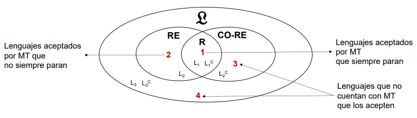
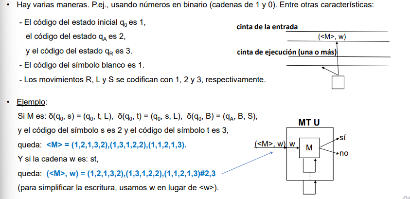
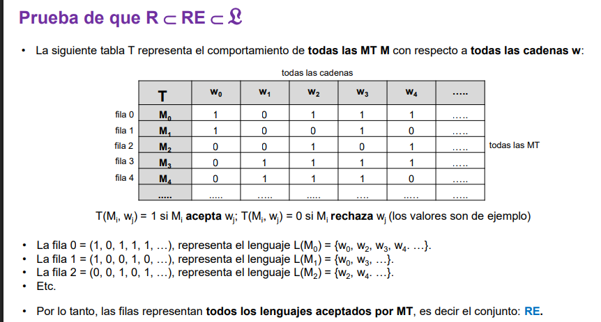

# TCVP - Clase 3: Indecibilidad 

La indecibilidad se refiere a la existencia de problemas computables para los cuales no existe un algoritmo general (representado por una Máquina de Turing que siempre se detiene) que pueda resolverlos para todas sus posibles entradas.

Teniendo en cuenta la jerarquía de la computabilidad: 

Es necesario probar que $R \subset RE \subset \mathcal{L}$ 
$RE-R$ -> problemas computables no decidibles (región 2)
$\mathcal{L} - RE$ -> problemas no computables (regiones 3 y 4)

## Máquina de Turing universal 
Una MT U es una máquina de Turing capaz de ejecutar cualquier otra Máquina de Turing. Esta idea se conoce como la noción de programa almacenado. 
La MT U toma como entrada una codificación de otra MT M () y una cadena de entrada w, y simula la ejecución de M sobre w.

> Su existencia es fundamental porque formaliza la idea de una computadora programable y permite razonar sobre las propiedades de todas las MTs posibles.

### Codificación de una máquina de Turing 
La MTU requiere una forma estándar de codificar cualquier Máquina de Turing en una cadena finita. Aunque los detalles específicos de la codificación pueden variar, lo importante es que cada MT tenga una codificación única y que la MTU pueda interpretar esta codificación para realizar la simulación. Esta capacidad de codificación permite tratar a las MTs como datos de entrada para otras MTs.

 _Codificación de ejemplo_ 

> Codificar las máquinas de Turing permite enumerarlas, por ejemplo, en el orden **canónico**: los códigos se ordenan de menor a mayor longitud y los códigos son longitudes iguales se ordenan según el orden alfanumérico. 

La fila $i$ de la tabla T representa el lenguaje reconocido por la MT $M_i$ que se puede especificar así $L_i = \{ w_j | M_i \text{ acepta } w_j \}$. Como T incluye a todas las máquinas de Turing entonces todas sus filas en conjunto reúnen a todos los lenguajes reconocidos por máquinas de Turing, es decir, a todos los lenguajes recursivamente enumerables ($RE$). 

#### Lenguaje diagonal (D)
Utilizando la idea de enumerar todas las Máquinas de Turing ($M_i$) y todads las posibles cadenas de entrada ($w_i$) en un orden canónico, se define entonces $D = \{ w_i | \text{la MT } M_i \text{acepta la cadena } w_i \}$ . El lenguaje $D^c$ está representado por la diagonal de T pero cambiando unos por ceros y ceros por unos, entonces $D^c$ contiene toda cadena rechazada por $M_i$: $D^c = \{w_i | M_i \text{ rechaza }  w_i \}$

$D$ está en RE
$D^c$ no está en RE. 
